== Deep Agents

4 central principles these "deep" agents have in common

1. Planning
2. Offload Context (Filesystem)
3. Task Delegation (Sub-agents)
4. Careful / Extensive Prompt Engineering

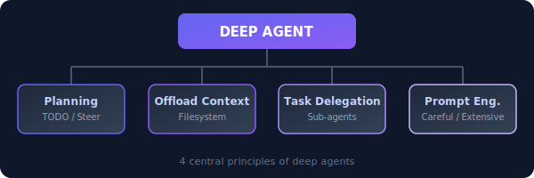

== Building effective agents

Deep agents are built on two pillars:

1. `Workflow`: Create scaffolding of predefined code path around LLM 
2. `Agents`: systems where LLMs dynamically direct their own processes and tool usage, maintaining control over how they accomplish tasks.

image::assets/diagrams/workflow-vs-agent.svg[Workflow vs Agent]

=== Building blocks, workflows, and agents

We'll start with our foundational building block—the augmented LLM—and progressively increase complexity, from simple compositional workflows to autonomous agents.

**Building block: The augmented LLM**
The basic building block of agentic systems is an LLM enhanced with augmentations such as retrieval, tools, and memory. Our current models can actively use these capabilities—generating their own search queries, selecting appropriate tools, and determining what information to retain.

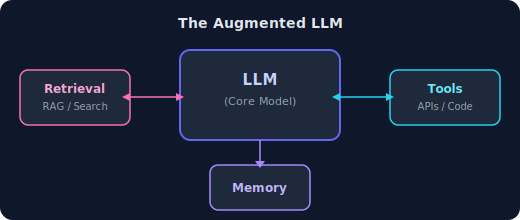

=== Use planning to help steer agent
Save TODO list to plan and repeat objectives / steer agent (see: Manus).
Plan for user approval (see: Claude Code plan mode, Deep Research).
Use plan to steer agent (see: open-deep-research, Anthropic multi-agent).

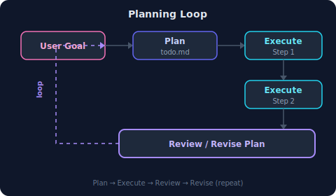

=== Use filesystem to offload context
Use file system for notes (see: Drew's post, Anthropic multi-agent).
Use file system (e.g., todo.md) to plan/track progress (see: Manus).
Use file system read/write tok-heavy context (see: Manus).
Use files for long-term memories (see: Ambient Agents course/repo).

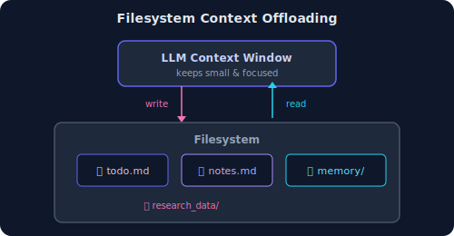

=== Use sub-agents to isolate context
Split context across multi-agents (see: Drew's post, Anthropic).
Delegate tasks to sub-agents (see: Claude Code task tool).
But, be careful (see: Cognition/Walden Yan)!
Multi-agents make conflicting decisions (see: Cognition/Walden Yan).
Sub-agents lower risk if avoid decisions (see: open-deep-research).

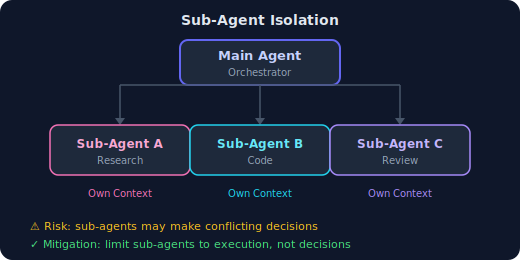

== How to apply context engineering

* Context Engineering

=== Some of the ways long contexts can fail

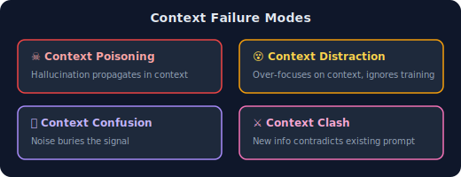

`Context Poisoning`: When a hallucination or other error makes it into the context, where it is repeatedly referenced.
`Context Distraction`: When a context grows so long that the model over-focuses on the context, neglecting what it learned during training.
`Context Confusion`: When superfluous information in the context is used by the model to generate a low-quality response.
`Context Clash`: When you accrue new information and tools in your context that conflicts with other information in the prompt.

=== How to fix your context
* `Context offloading`: store info outside the llm context window
* `RAG`: Retrieve relevant information from a knowledge base
* `Tool Loadout`: Only load the tools that are needed for the current task
* `Context Pruning`: Remove irrelevant information from the context
* `Context Summarization`: Summarize the context to reduce its size
* `Context quarantine`: Isolate context in their own context window

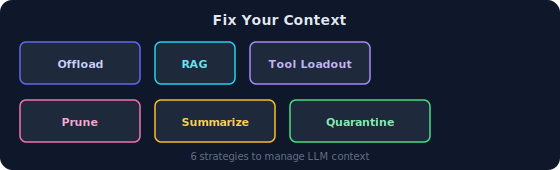

==== RAG
Create chunks of data and store them in a vector database.
When the user asks a question, retrieve the most relevant chunks and add them to the context.

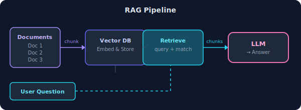

[source,python]
----
# Create chuk of data

# Create vector store

# Create retriever tool
retriever_tool = create_retriever_tool(
    retriever,
    "retrieve_blog_posts",
    "Search and return information about Lilian Weng blog posts.",
)

# Bind tools to LLM for agent functionality
llm_with_tools = llm.bind_tools(tools)

# Define the RAG agent system prompt
rag_prompt = """You are a helpful assistant tasked with retrieving information from a series of technical blog posts by Lilian Weng. Clarify the scope of research with the user before using your retrieval tool to gather context. Reflect on any context you fetch, and proceed until you have sufficient context to answer the user's research request."""

----

[NOTE]
====
Now understand this document retrival is token heavy, so we need to optimize it. Observations are getting appended in the context window. so every tool call is increasing the token count. This is the key motivation of context engineering.
====

==== Context Pruning
This avoid the context distration and context confusion. It is a way to reduce the token count by removing irrelevant information from the context.

What we do here is the first outcome of retrival tool is given to a separate llm to prune it. And then we use the pruned context in the main agent.

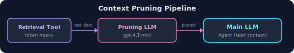

[source,python]
----
# Rag promt for main agent
rag_prompt = """You are a helpful assistant tasked with retrieving information from a series of technical blog posts by Lilian Weng. Clarify the scope of research with the user before using your retrieval tool to gather context. Reflect on any context you fetch, and proceed until you have sufficient context to answer the user's research request."""

# tool prompt for pruning in seprate llm - openai:gpt-4.1-mini
tool_pruning_prompt = """You are an expert at extracting relevant information from documents.

Your task: Analyze the provided document and extract ONLY the information that directly answers or supports the user's specific request. Remove all irrelevant content.

User's Request: {initial_request}

Instructions for pruning:
1. Keep information that directly addresses the user's question
2. Preserve key facts, data, and examples that support the answer
3. Remove tangential discussions, unrelated topics, and excessive background
4. Maintain the logical flow and context of relevant information
5. If multiple subtopics are discussed, focus only on those relevant to the request
6. Preserve important quotes, statistics, and research findings when relevant

Return the pruned content in a clear, concise format that maintains readability while focusing solely on what's needed to answer the user's request."""
----

==== Context summarization

Same as context pruning but instead of pruning we summarize the context. We use a separate llm to summarize the context and then use the summarized context in the main agent.

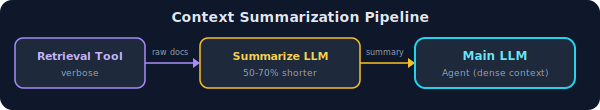

[source,python]
----
# Rag promt for main agent
rag_prompt = """You are a helpful assistant tasked with retrieving information from a series of technical blog posts by Lilian Weng. Clarify the scope of research with the user before using your retrieval tool to gather context. Reflect on any context you fetch, and proceed until you have sufficient context to answer the user's research request."""

# tool prompt for summarization in seprate llm - openai:gpt-4.1-mini
tool_summarization_prompt = tool_summarization_prompt = """You are an expert at condensing technical documents while preserving all critical information.

Transform the provided document into a comprehensive yet concise version. Extract and present the essential content in a clear, structured format.

Condensation Guidelines:
1. **Preserve All Key Information**: Include every important fact, statistic, finding, and conclusion
2. **Eliminate Verbosity**: Remove repetitive text, excessive explanations, and filler words
3. **Maintain Logical Structure**: Keep the natural flow and relationships between concepts
4. **Use Precise Language**: Replace lengthy phrases with direct, technical terminology
5. **Ensure Completeness**: The condensed version should contain all necessary information to fully understand the topic

Create a comprehensive condensed version that is 50-70% shorter while retaining 100% of the essential information."""
----

==== Context offloading

**Using langgraph state object**
Act of storing information outside the llm context window, usually via a tool that stores and manages the information. This is useful for long term memory.

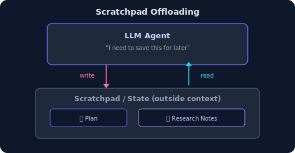

Anthropic "think_tool" is an example of context offloading. Anthropics multi agent researcher makes explicit use of this tool to store and manage information outside the llm context window.

Manus also perform context offloading to the filesystem. They mention this is highly useful to store token heavy tool calls. Initially manus write plans in todo.md and rewrites it during the execution.

**Manus**
Typical task in Manus requires around 50 tool calls.

**Anthropic**
Production agents often engage in conversations spanning hundreds of turns

* Langgraph has something called state object which persist the data across the runs. We can use this to store and manage information outside the llm context window.

[source,python]
----
# Create a scratchpad state

# Writetoscratpad tool

# Read from scratchpad tool

# Tell LLM about the research flow
scratchpad_prompt = """You are a sophisticated research assistant with access to web search and a persistent scratchpad for note-taking.

Your Research Workflow:
1. **Check Scratchpad**: Before starting a new research task, check your scratchpad to see if you have any relevant information already saved and use this to help write your research plan
2. **Create Research Plan**: Create a structured research plan
3. **Write to Scratchpad**: Save the research plan and any important information to your scratchpad
4. **Use Search**: Gather information using web search to address each aspect of your research plan
5. **Update Scratchpad**: After each search, update your scratchpad with new findings and insights
5. **Iterate**: Repeat searching and updating until you have comprehensive information
6. **Complete Task**: Provide a thorough response based on your accumulated research

Tools Available:
- WriteToScratchpad: Save research plans, findings, and progress updates
- ReadFromScratchpad: Retrieve previous research work and notes
- TavilySearch: Search the web for current information

Always maintain organized notes in your scratchpad and build upon previous research systematically."""

----

LLM follow this flow to complete the task:

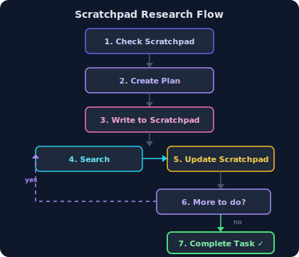

**Using InMemory**
Similar to langgraph state object but it is not persistent across the runs.

==== Tool Loadout
Act of selecting only relevent tool defination to add to your context window.

* Avoid context confusion- Avoid overlapping tool defination.

The Langgraph bigtool library is a grate way to apply semantic search over tool defination to select only relevent tool defination to add to your context window.

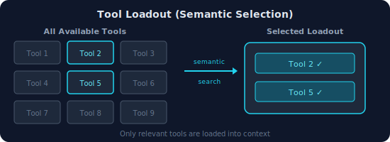

==== Context quarantine

Act of isolating the context in their own dedicated threads, each uses seprately by one or more llm.

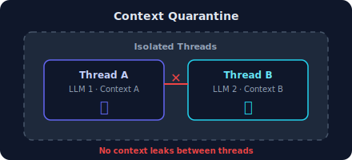

Refrence:
* https://www.dbreunig.com/2025/06/26/how-to-fix-your-context.html
* https://github.com/langchain-ai/how_to_fix_your_context
* https://github.com/langchain-ai/open_deep_research
* https://blog.langchain.com/deep-agents/