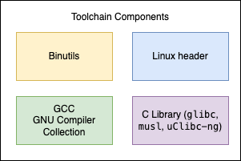
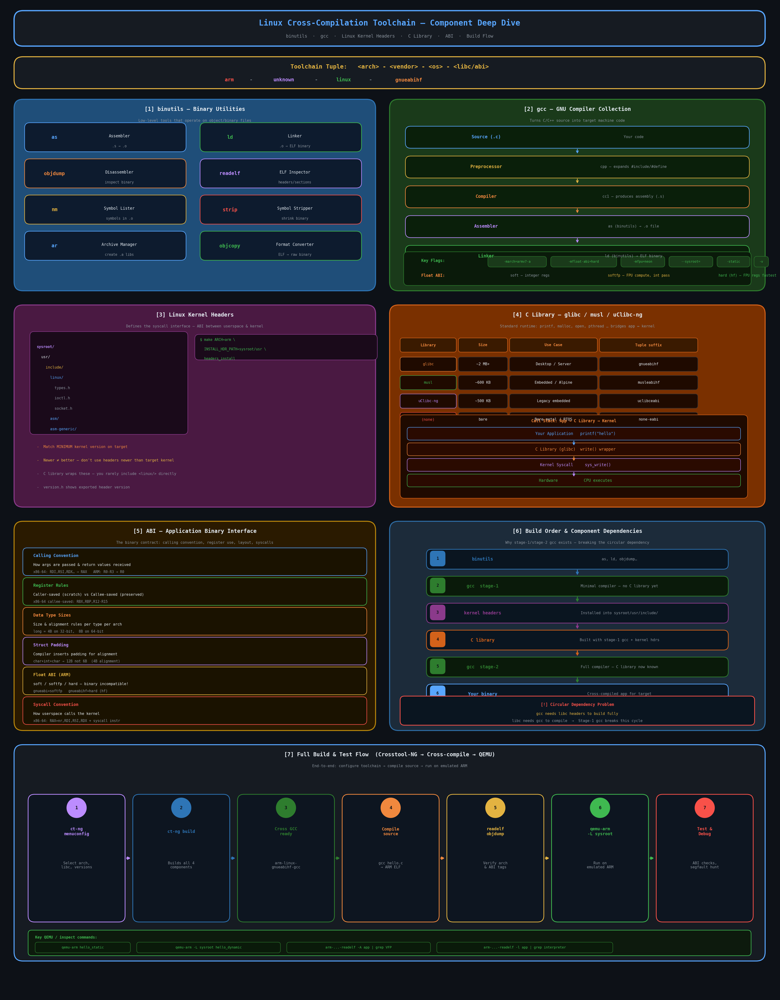

# Embedded Linux Toolchains

A practical reference for understanding, building, and using toolchains in Embedded Linux development. We will start with theoretical concepts and move to practical implementation. We will be using ARM64 as our target architecture.

---

## Table of Contents

1. [What is a Toolchain?](#1-what-is-a-toolchain)
2. [Key Components](#2-key-components)
3. [Cross-Compilation Concepts](#3-cross-compilation-concepts)
4. [Toolchain Naming Convention (Tuple)](#4-toolchain-naming-convention-tuple)
5. [Types of Toolchains](#5-types-of-toolchains)
6. [C Library Options](#6-c-library-options)
7. [Getting a Toolchain](#7-getting-a-toolchain)
8. [Using a Toolchain](#8-using-a-toolchain)
9. [Sysroot](#9-sysroot)
10. [Build Systems That Manage Toolchains](#10-build-systems-that-manage-toolchains)
11. [Common Pitfalls](#11-common-pitfalls)
12. [Quick Reference](#12-quick-reference)

---

## 1. What is a Toolchain?

A **toolchain** is a set of programming tools used in sequence to produce a software artifact (typically a binary executable). In the context of Embedded Linux, a toolchain transforms C/C++ source code into machine code that runs on a target embedded processor.

> A toolchain also typically includes a **debugger** (GDB), binary utilities (binutils), and a **C standard library** (glibc / musl / uClibc-ng).

---

## 2. Key Components
These are the key components of a toolchain:



| Component | Tool | Role |
|---|---|---|
| Binary utils | `objdump`, `readelf`, `nm`, `strip`, `ar`, `objcopy`, `as`, `ld` | Inspect and manipulate binaries |
| Compiler | `gcc(GNU Compiler Collection)` / `clang(LLVM Compiler Infrastructure)` | Translates C/C++ → assembly |
|kernel headers |`linux/`| Linux kernel headers |
| Debugger | `gdb` / `gdbserver` | Debug running processes |
| C Library | `glibc` / `musl` / `uClibc-ng` | Standard C runtime & syscall wrappers |

## 2.1. Binutils
**What it is:** A collection of low-level tools that operate on binary/object files. It's the foundation everything else builds on.
Key tools inside binutils:

| Tool | Role |
|------|------|
| **as** | Assembler — turns .s assembly into .o object files |
| **ld** | Linker — combines .o files into a final executable or .so |
| **objdump** | Disassemble / inspect object files |
| **readelf** | Parse ELF headers, sections, symbols |
| **nm** | List symbols in an object file |
| **strip** | Remove debug symbols to shrink binaries |
| **ar** | Create/manage static libraries (.a files) |
| **objcopy** | Convert between binary formats (ELF → raw binary, etc.) |

**Practical use:**

```bash
# Inspect what architecture a binary was compiled for
arm-linux-gnueabihf-readelf -h my_binary | grep Machine

# Disassemble an ARM object file
arm-linux-gnueabihf-objdump -d my_file.o

# Check what symbols a .o exposes
arm-linux-gnueabihf-nm my_file.o

# Strip debug info before deploying to target
arm-linux-gnueabihf-strip my_binary
```

## 2.2. GCC (GNU Compiler Collection)
**What it is:** The compiler that turns C/C++ source into machine code. In a cross toolchain, it targets a different architecture than the machine it runs on.

GCC is a compiler driver which orchestrates the build process, It contains the following components:

```bash
Source (.c)
    ↓  [preprocessor: cpp]     → expands #include, #define
    ↓  [compiler: cc1]         → produces assembly (.s)
    ↓  [assembler: as]         → produces object file (.o)  ← uses binutils
    ↓  [linker: ld]            → produces final binary       ← uses binutils
```

1. gcc look for cpp, cc1, as, ld in the arm-linux-gnueabihf/bin/<as,ld,etc> and use them to build the final binary.
2. gcc finds linux headers in the arm-linux-gnueabihf/include/linux/.
3. gcc looks for glibc in the arm-linux-gnueabihf/lib/<.a,.so>
4. gcc finds actual compilor cc1 in arm-linux-gnueabihf/libexec/
5. gcc uses collect2 to collect the initalization functions,wrapping the linker. It calls ld.


| Compiler | Description |
|----------|-------------|
| **GCC** (GNU Compiler Collection) | The industry standard for Linux development — mature, widely supported, extensive features. |
| **Clang** (LLVM project) | Modern, fast compiler with excellent diagnostics and better C++ support. Integrates with LLVM toolchain. |

**GCC usage example:**
```bash
# Compile a C file for ARM
arm-linux-gnueabihf-gcc -c main.c -o main.o

# Link object files into an executable
arm-linux-gnueabihf-gcc main.o -o my_program

# With optimizations (-O2) and debug info (-g)
arm-linux-gnueabihf-gcc -O2 -g main.c -o my_program
```

Practical example:

```bash
# Compile a simple program for ARM Linux
arm-linux-gnueabihf-gcc -o hello hello.c

# See every internal step GCC takes
arm-linux-gnueabihf-gcc -v -o main main.c

# Compile only to assembly (useful for understanding ABI)
arm-linux-gnueabihf-gcc -S -o hello.s hello.c

# Compile only to object file (no linking yet)
arm-linux-gnueabihf-gcc -c -o hello.o hello.c

# Specify exact CPU tuning
arm-linux-gnueabihf-gcc -march=armv7-a -mfpu=neon -mfloat-abi=hard -o hello hello.c
```

**The float-abi detail (very practical for ARM):**

soft — all float ops done in software, passed in integer registers
softfp — uses FPU instructions, but passes args in integer registers
hard — uses FPU instructions AND passes args in FPU registers (fastest, but incompatible with soft libraries)

If your toolchain is gnueabihf → h = hard float. You can't link hard objects with soft libraries — this is one of the most common ABI mismatch errors.

## 2.3. Linux Kernel Headers

What they are: C header files exported from the Linux kernel that define the syscall interface — things like ioctl numbers, struct stat, POSIX types, signal numbers, etc.

Why they matter: The C library (and your code) needs to know how to talk to the kernel. These headers define that contract.

Key location in a sysroot:

```
sysroot/
  usr/
    include/
      linux/        ← kernel headers live here
        types.h
        ioctl.h
        socket.h
        ...
      asm/          ← arch-specific (e.g. ARM register defs)
      asm-generic/
```

How they're generated:

```bash
From kernel source, export headers for a target arch
make ARCH=arm INSTALL_HDR_PATH=/path/to/sysroot/usr headers_install
```

Note: Important rule — kernel headers version:

They should match the minimum kernel version you'll run on
Newer headers ≠ always better — using headers newer than your target kernel can introduce unavailable syscalls
The C library wraps these — you rarely include <linux/...> directly in app code, but glibc/musl does internally

Practical inspection:

```bash
# See what syscall numbers look like for ARM
cat /path/to/sysroot/usr/include/asm/unistd.h

# Check the version of exported headers
cat /path/to/sysroot/usr/include/linux/version.h
```
---



## 3. Cross-Compilation Concepts

In native compilation, **build**, **host**, and **target** machines are the same. In embedded development, they differ:

| Term | Definition | Example |
|---|---|---|
| **Build** | Machine running the compiler | x86-64 Linux (your laptop) |
| **Host** | Machine the compiler runs on | Same as build in most cases |
| **Target** | Machine the resulting binary runs on | ARM Cortex-A53 (embedded board) |

**Cross-compilation** is compiling on the *build* machine to produce binaries for the *target* machine.

```
┌───────────────────────┐             Binary          ┌──────────────────────┐
│  Build Machine        │ ─────────────────────────▶  │  Target Device       │
│  (x86-64 / macOS /    │                             │  (ARM / MIPS /       │
│   Linux)              │                             │   RISC-V / ...)      │
└───────────────────────┘                             └──────────────────────┘
         ▲
 Cross-compiler runs here
```

**Native compilation vs Cross-compilation:**

| Case | Build Machine | Host Machine | Target Machine | Toolchain Prefix |
|------|---------------|--------------|----------------|------------------|--------------------|
| **Native** | x86-64 Linux | x86-64 Linux | x86-64 Linux | `x86_64-linux-gnu-` | host=target=build
| **Cross** | x86-64 Linux | x86-64 Linux | ARM Cortex-A53 | `aarch64-linux-gnu-` | host=build≠target


---

## 4. Toolchain Naming Convention (Tuple)

Toolchain binaries follow a structured naming scheme:

```
<arch>-<vendor>-<os/kernel>-<abi/libc>-<tool>
```

### Examples

| Tuple Prefix | Meaning |
|---|---|
| `arm-linux-gnueabihf-` | 32-bit ARM, Linux, GNU libc, hard-float ABI |
| `aarch64-linux-gnu-` | 64-bit ARM (ARMv8), Linux, GNU libc |
| `mipsel-linux-musl-` | MIPS little-endian, Linux, musl libc |
| `riscv64-linux-gnu-` | 64-bit RISC-V, Linux, GNU libc |
| `x86_64-linux-gnu-` | x86-64, Linux, GNU libc (native cross) |
| `arm-none-eabi-` | 32-bit ARM, no OS (bare-metal), EABI |

### Decoding the fields

- **arch**: Target CPU architecture (`arm`, `aarch64`, `mipsel`, `riscv64`, `x86_64`)
- **vendor**: Optional origin (`none`, `linux`, `buildroot`, or empty)
- **os/kernel**: Operating system (`linux`, `none` for bare-metal, `elf`)
- **abi/libc**: ABI or C library (`gnueabi`, `gnueabihf`, `musl`, `uclibc`)

---

## 5. Types of Toolchains

### 5.1 Native Toolchain
Compiles code for the same machine it runs on.
- Used for: Host tools, build system utilities
- Example: `gcc` on an x86-64 Ubuntu machine producing x86-64 binaries

### 5.2 Cross-Compilation Toolchain
Runs on the build machine, produces binaries for a different target architecture.
- Used for: Compiling Linux kernels, rootfs, applications for embedded boards
- Example: `arm-linux-gnueabihf-gcc` running on x86-64 producing ARM binaries

### 5.3 Cross-Native (Canadian Cross)
The toolchain itself is built for a different host than the build machine.
- Used for: Shipping a toolchain *to* the target device so it can self-compile
- Example: Building an ARM-hosted `arm-linux-gnueabihf-gcc` on an x86-64 build machine

### 5.4 Bare-Metal Toolchain
Targets systems without an OS. No Linux kernel, no C library (or a minimal one like `newlib`).
- Used for: MCU firmware, bootloaders (U-Boot early stages)
- Example: `arm-none-eabi-gcc`

---

## 6. C Library Options

The C library is critical in Embedded Linux — it provides the standard C API and wraps Linux system calls.

| Library | Size | Features | Common Use Case |
|---|---|---|---|
| **glibc** | Large (~2 MB) | Full POSIX, best compatibility | Desktop-class embedded (i.MX8, RPi) |
| **musl** | Small (~600 KB) | Lightweight, strict POSIX, static-friendly | OpenWrt, Alpine Linux, resource-constrained |
| **uClibc-ng** | Very small | Subset of glibc API, configurable | Legacy small devices, Buildroot |
| **newlib** | Minimal | Bare-metal / RTOS use | MCU firmware, no Linux kernel |
| **dietlibc** | Minimal | Optimized for size | Extremely size-constrained targets |

> **Recommendation**: Use **musl** for new OpenWrt or resource-constrained projects. Use **glibc** when you need broad software compatibility.

---
## Overall Build Process

1. Build binutils
2. Build dependencies of gcc: mpc, mpfr, gmp, libelf, libstdc++
3. Install Kernel headers
4. Build first stage gcc : no support for C library, only support for static linking. Used to cross compile the libc.
5. Build and Install libc(Use first stage GCC to build the C library for the target architecture)
6. Build second stage gcc : with support for C library

## sysroot

1. The sysroot is a logical root directory for headers and libraries.
2. Where gcc look for headers and ld looks for libraries.
  2.1 let say "#include <stdio.h>" then gcc will look for stdio.h in the sysroot/usr/include directory.
  2.2 let say user pass -lfoo command at time of linking then ld will look for foo.so or -lfoo.a in the sysroot/usr/lib directory.
3. Both gcc and binutils are built with --with-sysroot=<path_to_sysroot>
4. kernel headers and C library are installed in the sysroot
5. If toolchain has been moved to a different location, gcc will still find its sysroot if it is in subdir of prefix
6. Can be overwritten at runtime using --sysroot=<path_to_sysroot> flag
7. The current sysroot can be printed using `gcc --print-sysroot` command

## Architecture Tuning

1.gcc provide several config time options to tune for specific architecture.
1.1 --with-arch, --with-tune, --with-cpu, --with-fpu, --with-abi, --with-float-abi
1.2 They can be overridden at runtime using -march, -mtune, -mcpu, -mfpu, -mabi, -mfloat-abi flags. However, part of toolchainis built with the config time options, so they cannot be changed.
2. Passing -march=armv5te is not sufficient to make your binary work on armv5te architecture.

## ABI
1. ABI = Application Binary Interface
2. Define calling convention, stack layout, register usage, etc.
3. Size of basic data types, structure padding, etc.
4. How systemcalls are made, how they are returned, etc.
5. EABI and EABIHf


## 7. Getting a Toolchain

### Option A: Distro Package (Fastest)

```bash
# Debian / Ubuntu
sudo apt install gcc-aarch64-linux-gnu binutils-aarch64-linux-gnu

# For 32-bit ARM with hard-float
sudo apt install gcc-arm-linux-gnueabihf
```

### Option B: Pre-built Toolchain (Linaro / ARM)

Download from official sources:

- **Linaro**: https://releases.linaro.org/components/toolchain/binaries/
- **ARM GNU Toolchain**: https://developer.arm.com/downloads/-/arm-gnu-toolchain-downloads
- **Bootlin (musl/uClibc-ng)**: https://toolchains.bootlin.com/

```bash
# Example: install Linaro aarch64 toolchain
wget https://releases.linaro.org/components/toolchain/binaries/latest-7/aarch64-linux-gnu/gcc-linaro-7.5.0-2019.12-x86_64_aarch64-linux-gnu.tar.xz
tar -xf gcc-linaro-*.tar.xz
export PATH=$PWD/gcc-linaro-7.5.0-2019.12-x86_64_aarch64-linux-gnu/bin:$PATH
```

### Option C: Build with Crosstool-NG (Full Control)

[Crosstool-NG](https://crosstool-ng.github.io/) builds a complete, custom toolchain from source.

```bash
# Install crosstool-ng
git clone https://github.com/crosstool-ng/crosstool-ng.git
cd crosstool-ng
./bootstrap && ./configure --enable-local && make

# List sample configurations
./ct-ng list-samples

# Configure for a target (e.g. aarch64-unknown-linux-gnu)
./ct-ng aarch64-unknown-linux-gnu

# Customize (optional)
./ct-ng menuconfig

# Build (~30-60 min)
./ct-ng build
```

### Option D: Use a Build System (Recommended for Projects)

Build systems like **Buildroot** or **Yocto/OpenEmbedded** generate and manage their own internal toolchain automatically — see [Section 10](#10-build-systems-that-manage-toolchains).

---

## 8. Using a Toolchain

Once installed, set the `CROSS_COMPILE` environment variable (convention used by Linux kernel, U-Boot, and most embedded projects):

```bash
export CROSS_COMPILE=aarch64-linux-gnu-
export ARCH=arm64
```

### Compiling a simple program

```bash
# Native
gcc -o hello hello.c

# Cross-compile for aarch64
aarch64-linux-gnu-gcc -o hello hello.c

# Inspect the output
file hello
# hello: ELF 64-bit LSB executable, ARM aarch64, ...
```

### Compiling the Linux Kernel

```bash
export CROSS_COMPILE=aarch64-linux-gnu-
export ARCH=arm64

make defconfig
make -j$(nproc) Image dtbs modules
```

### Compiling U-Boot

```bash
export CROSS_COMPILE=arm-linux-gnueabihf-

make <board>_defconfig
make -j$(nproc)
```

### Useful flags

| Flag | Purpose |
|---|---|
| `-march=armv8-a` | Target specific CPU architecture |
| `-mcpu=cortex-a53` | Tune for specific CPU core |
| `-mfpu=neon-vfpv4` | Enable NEON/VFP FPU (32-bit ARM) |
| `-mfloat-abi=hard` | Use hardware floating-point ABI |
| `--sysroot=<path>` | Point to target sysroot for headers/libs |
| `-static` | Link statically (no `.so` dependencies) |

---

## 9. Sysroot

The **sysroot** is a directory that mirrors the target's root filesystem layout, containing:

- Headers (`include/`)
- Libraries (`lib/`, `usr/lib/`)
- C library (`.so` / `.a` files)

It allows the cross-compiler to find the correct target libraries during linking, without polluting the host system.

```
sysroot/
├── usr/
│   ├── include/          ← Target system headers
│   └── lib/              ← Target libraries
└── lib/                  ← C library, ld-linux, etc.
```

### Using the sysroot

```bash
aarch64-linux-gnu-gcc --sysroot=/path/to/sysroot -o app app.c
```

Build systems (Buildroot, Yocto) manage the sysroot automatically and pass it to the compiler via their internal wrapper scripts.

---

## 10. Build Systems That Manage Toolchains

For real embedded Linux projects, using a full build system is strongly recommended:

### Buildroot

- Simple, fast, Makefile-based
- Builds: toolchain, kernel, bootloader, rootfs
- Toolchain: internal (Crosstool-NG based) or external
- Best for: small-to-medium projects, routers, custom appliances

```bash
make menuconfig      # Configure target, toolchain, packages
make -j$(nproc)      # Build everything
```

### Yocto / OpenEmbedded

- Highly flexible, layer-based recipe system
- Produces: SDKs, images, toolchains (as artifacts)
- Best for: complex products, commercial-grade BSPs
- Steeper learning curve

```bash
source oe-init-build-env
bitbake core-image-minimal        # Build a minimal image
bitbake meta-toolchain             # Build a standalone SDK/toolchain
```

### OpenWrt Build System

- Purpose-built for network devices
- Manages its own cross-compilation toolchain (musl-based)
- Provides an opkg package feed infrastructure

```bash
make menuconfig      # Select target platform and packages
make toolchain/install  # Build only the toolchain
make -j$(nproc)      # Full build
```

---

## 11. Common Pitfalls

### ❌ Mismatched ABI (hard-float vs soft-float)

Mixing `gnueabi` (soft-float) and `gnueabihf` (hard-float) libraries will cause illegal instruction faults at runtime.

```bash
# Check your binary's ABI
readelf -A <binary> | grep Tag_ABI_VFP_args
```

### ❌ Wrong C Library Version

Binaries compiled against a newer glibc will fail with `version 'GLIBC_2.xx' not found` on older targets. Build against the oldest glibc you plan to support, or use musl for static linking.

### ❌ Host Libraries Leaking into Build

Always set `--sysroot` or use a build system wrapper. Without it, the compiler may link against host `/usr/lib` libraries, producing binaries that won't run on the target.

### ❌ Forgetting `ARCH` and `CROSS_COMPILE`

Linux kernel and U-Boot builds silently default to the native architecture if these are unset. Always double-check with:

```bash
make ARCH=arm64 CROSS_COMPILE=aarch64-linux-gnu- kernelversion
```

### ❌ `file` command reports "x86-64" for cross-compiled output

You compiled with `gcc` instead of `aarch64-linux-gnu-gcc`. The `CROSS_COMPILE` prefix was not set or not picked up.

---

## 12. Quick Reference

### Environment Variables

```bash
export ARCH=arm64                          # Target architecture (kernel/uboot)
export CROSS_COMPILE=aarch64-linux-gnu-   # Toolchain prefix
export PATH=/opt/toolchain/bin:$PATH       # Add toolchain to PATH
```

### Useful Commands

```bash
# Identify a binary's target architecture
file <binary>
readelf -h <binary>

# List dynamic library dependencies
aarch64-linux-gnu-readelf -d <binary> | grep NEEDED

# Strip debug symbols (reduce binary size)
aarch64-linux-gnu-strip --strip-unneeded <binary>

# Disassemble a binary
aarch64-linux-gnu-objdump -d <binary>

# Check symbol table
aarch64-linux-gnu-nm <binary>

# Find which library provides a symbol
aarch64-linux-gnu-nm -D /path/to/lib.so | grep <symbol>
```

### Toolchain Sources

| Source | URL |
|---|---|
| Linaro Toolchains | https://releases.linaro.org/components/toolchain/binaries/ |
| ARM GNU Toolchain | https://developer.arm.com/downloads/-/arm-gnu-toolchain-downloads |
| Bootlin Toolchains | https://toolchains.bootlin.com/ |
| Crosstool-NG | https://crosstool-ng.github.io/ |
| Buildroot | https://buildroot.org/ |
| Yocto Project | https://www.yoctoproject.org/ |

---

## Further Reading

- [The Buildroot User Manual](https://buildroot.org/downloads/manual/manual.html)
- [Yocto Project Quick Build](https://docs.yoctoproject.org/brief-yoctoprojectqs/index.html)
- [Crosstool-NG Documentation](https://crosstool-ng.github.io/docs/)
- [Linux From Scratch - Cross-Toolchain](https://www.linuxfromscratch.org/lfs/view/stable/chapter05/introduction.html)
- [Mastering Embedded Linux Programming (Book)](https://www.packtpub.com/product/mastering-embedded-linux-programming-third-edition/9781789530384)
