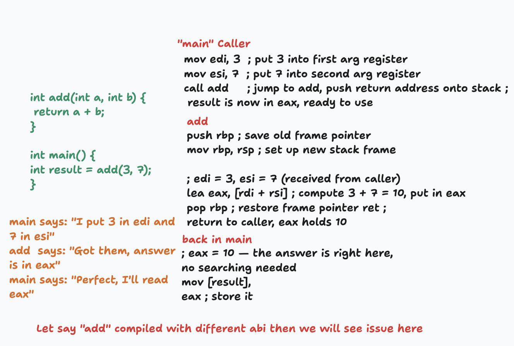
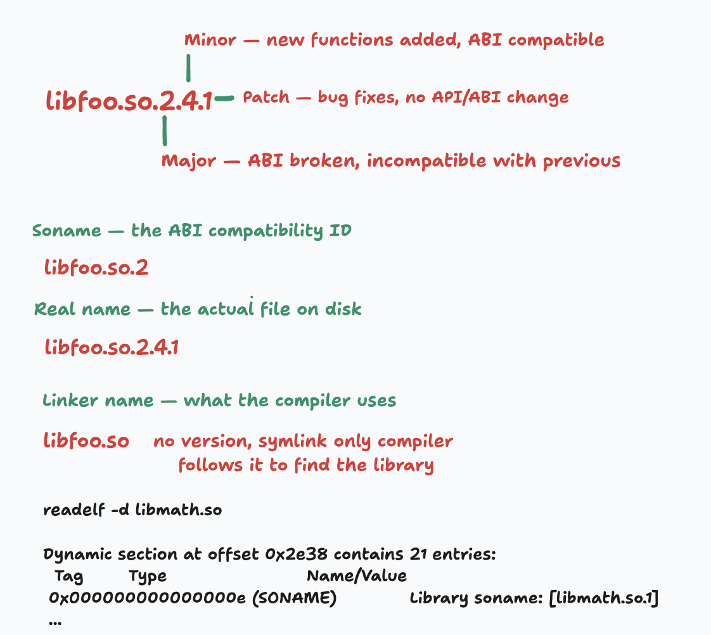

# ABI — Application Binary Interface

> **ABI = the set of rules that allow separately compiled binary modules to work
together.**

Two object files can only be linked and run together correctly if they agree on:

- How function arguments are passed (registers or stack).
- What registers must be preserved across a call.
- How structures are laid out in memory.
- How symbols (function/variable names) are represented in object files.
- How exceptions are propagated (C++).
- What the system call interface looks like.

the ABI is affected by

1. the CPU’s instruction set architecture (ISA)
2. the operating system (OS)
3. the compiler

## 1. API vs ABI — What's the Difference?

### API — Application Programming Interface

An **API** is a **source-level contract**. It tells a programmer *how* to call a
function or use a library at the **C/C++ (or any language) source code level**.

```c
/* API: the function signature a programmer sees */
int printf(const char *format, ...);
```

- Defined in **header files** (`.h`, `.hpp`).
- Consumed at **compile time** — the compiler reads it.
- If you change an API, the calling code **fails to compile**.
- Example APIs: POSIX `open()`, `malloc()`, C++ STL containers, Linux `ioctl()`.

### ABI — Application Binary Interface

An **ABI** is a **binary-level contract**. It tells the machine **how** compiled
code actually communicates — which registers hold arguments, how the stack is
laid out, how structs are packed in memory, how symbols are named in object
files.

- Defined by the **toolchain, OS, and processor architecture** together.
- Consumed at **link time** and **run time**.
- If you break an ABI, the calling code **compiles fine but crashes or gives
wrong results at runtime**.

### Side-by-Side Comparison

| Dimension | API | ABI |
|-----------|-----|-----|
| Level | Source code | Machine code / binary |
| Contract in | Header files | Compiler, linker, OS, CPU arch |
| Broken by | Changing function signatures | Changing calling convention, struct layout, register use |
| Detected at | **Compile time** | **Link time or run time** |
| Who uses it | Programmers | Compilers, linkers, dynamic loaders |
| Example | `printf(const char*, ...)` | R0 holds first arg, stack grows down, return in R0 |

> **Key insight:** An API is a contract between **programmers**. An ABI is a
> contract between **binaries**.  
> You can have a stable ABI even after changing source code — as long as the
> compiled binary interface does not change.

## 2. What an ABI Defines

* Calling convention
* Register usage
* Stack layout and frame structure
* Data type sizes and alignment
* Exception handling
* Symbol naming (name mangling)
* Linkage conventions (e.g., how .so files refer to each other)
* System call interface

### 2.1 Calling Convention
Which registers carry arguments, return values, and the link register. Who
saves/restores caller-saved vs callee-saved registers.



### 2.2 Register Usage
ABI defines how registers are used when compiling source code. Let say if assembler 
generates object code for "int add(int a, int b)" and compiler uses R0 for first 
argument and R1 for second argument and R2 for return value. Then the assembler 
should generate object code for add function that uses R0 for first argument and 
R1 for second argument and R2 for return value.

Else linker will fail to link the object code for add function with the object
code for main function. Resulting into runtime error.

Every register gets a role: argument, return value, scratch, preserved, stack
pointer, frame pointer, link register.

### 2.3 Stack Layout and Frame Structure
Direction of growth (almost always downward), alignment requirements, where
local variables, saved registers, and the return address live.

When function call happens, stack frame is created for the function. The way stack
layed out also depends on ABI. How much stack space is allocated for local
variables, saved registers and return address depends on ABI.

### 2.4 Data-Type Sizes and Alignment

```
Type        LP64 (Linux/x86-64)    ILP32 (Linux/ARM 32-bit)
char        1 byte / 1-byte align   1 byte / 1-byte align
short       2 / 2                   2 / 2
int         4 / 4                   4 / 4
long        8 / 8                   4 / 4   ← differs!
long long   8 / 8                   8 / 8
pointer     8 / 8                   4 / 4   ← differs!
```

### 2.5 Struct / Union Layout (padding and packing)
The compiler inserts padding bytes to satisfy alignment rules. Two compilers
with different padding strategies produce structs of different sizes → ABI break.

### 2.6 Object File and Binary Format
ELF (Linux), PE/COFF (Windows), Mach-O (macOS). Relocations, symbol table
format, section names.

### 2.7 Exception Handling and Unwinding
DWARF-based `.eh_frame` tables (Itanium C++ ABI), SJLJ exceptions. Mixing
incompatible schemes crashes the unwinder.

## 3. Types of ABIs

* Machine / Processor ABI (psABI)
* Library ABI (Shared Library ABI)
* Kernel ABI (KABI)

```
┌─────────────────────────────────────┐
│          Language ABI               │  Level 5
├─────────────────────────────────────┤
│          System ABI                 │  Level 4
├─────────────────────────────────────┤
│          Kernel ABI                 │  Level 3
├─────────────────────────────────────┤
│          psABI                      │  Level 2
├─────────────────────────────────────┤
│          Hardware                   │  Level 1
└─────────────────────────────────────┘
```

### 3.1 Machine / Processor ABI (psABI)
Defined per CPU architecture. 
It covers:

- `Calling convention`
- `Register roles`
- `Stack alignment`

| Architecture | ABI Specification |
|---|---|
| x86-64 Linux | System V AMD64 ABI |
| ARM 32-bit | ARM EABI / AAPCS |
| ARM 64-bit | AAPCS64 (AArch64 PCS) |
| RISC-V | RISC-V ELF psABI |
| MIPS | MIPS O32 / N32 / N64 |
| PowerPC 64-bit | ELFv2 ABI |

#### What the psABI Defines?

1. Register Set and Roles

```
x86-64 psABI register map:

rax   scratch / return value
rbx   callee-saved
rcx   scratch / arg 4 (user ABI)
rdx   scratch / arg 3 / return (high half)
rsi   scratch / arg 2
rdi   scratch / arg 1
rbp   callee-saved / frame pointer
rsp   stack pointer (always)
r8    scratch / arg 5
r9    scratch / arg 6
r10   scratch
r11   scratch
r12   callee-saved
r13   callee-saved
r14   callee-saved
r15   callee-saved
rip   instruction pointer (not general purpose)
```

2. Data Type Sizes and Alignment
```
Type       Size   Alignment    Purpose
char       1      1 byte       single bytes
short      2      2 bytes      2-byte values
int        4      4 bytes      32-bit integers
long       8      8 bytes      64-bit integers (LP64)
pointer    8      8 bytes      8-byte addresses
float      4      4 bytes      single-precision float
double     8      8 bytes      double-precision float
```


3. Struct Layout and Padding

```
struct Example {
    char  a;    // offset 0,  size 1
    // 3 bytes padding ← psABI alignment rule
    int   b;    // offset 4,  size 4
    char  c;    // offset 8,  size 1
    // 7 bytes padding
    long  d;    // offset 16, size 8
};              // total: 24 bytes
```

4. Calling Convention Foundation

```
psABI defines:                    OS ABI adds:
──────────────                    ────────────
which regs are scratch      →     which scratch regs carry args
which regs are preserved    →     specific arg ordering
stack direction/alignment   →     shadow space / red zone rules
return value register       →     struct return conventions
```

### 3.2 Library ABI (Shared Library ABI)
The contract exported by a `.so` (shared object). Includes:
- The set of exported symbols (functions, global variables).
- Their calling conventions.
- The layout of any structs passed across the library boundary.
- The library's SONAME (`libc.so.6`).

```
┌─────────────────────────────────────┐
│          Language ABI               │
├─────────────────────────────────────┤
│       Library ABI         ◄── HERE  │
├─────────────────────────────────────┤
│          System ABI                 │
├─────────────────────────────────────┤
│          Kernel ABI                 │
├─────────────────────────────────────┤
│          psABI                      │
└─────────────────────────────────────┘
```

A library has a **stable ABI** if a new version of the `.so` can drop in to
replace the old one without recompiling the caller.

**Library versioning example:**

```
libfoo.so        →  symlink to →  libfoo.so.2        →  libfoo.so.2.1.3
  (linker name)                    (SONAME / runtime)    (real file)
```



Incrementing the **SONAME** (`libfoo.so.2` → `libfoo.so.3`) signals an ABI break.

**Build library with SONAME**

```bash
gcc -shared -fPIC foo.c \
    -Wl,-soname,libfoo.so.1 \    # ← bake soname in
    -o libfoo.so.1.0.0

ln -s libfoo.so.1.0.0  libfoo.so.1
ln -s libfoo.so.1      libfoo.so
```
 * Your App Links Against v1.0.0

 ```bash
 gcc app.c -lfoo -o app
 $ readelf -d app | grep NEEDED

NEEDED    libfoo.so.1     ← soname recorded, not the full version
```

Your app permanently says "I need libfoo.so.1" — not .1.0.0, not .2. Just the
major version.

* Patch Release — v1.0.1 (bug fix)

```bash
gcc -shared -fPIC foo.c \
    -Wl,-soname,libfoo.so.1 \    # ← soname unchanged
    -o libfoo.so.1.0.1

# update symlinks
ln -sf libfoo.so.1.0.1  libfoo.so.1   # ← soname symlink moves
ln -sf libfoo.so.1       libfoo.so

# On disk
libfoo.so      → libfoo.so.1
libfoo.so.1    → libfoo.so.1.0.1    ← updated
libfoo.so.1.0.0   (old file, still there)
libfoo.so.1.0.1   (new file)
```

Your app still says NEEDED libfoo.so.1. Dynamic linker follows the symlink →
gets 1.0.1 automatically. No recompile needed. App just got the bug fix.

* Major Release — v2.0.0 (ABI break)

```bash
gcc -shared -fPIC foo.c \
    -Wl,-soname,libfoo.so.2 \
    -o libfoo.so.2.0.0

ln -s libfoo.so.2.0.0  libfoo.so.2
ln -s libfoo.so.2      libfoo.so
```

Your app still runs fine against `libfoo.so.1`. It never sees v2.0.0.

#### Symbol Versioning Inside the .so
* version script
```
// version script: libfoo.map

LIBFOO_1.0 {
    global:
        image_create;
        image_draw;
        image_destroy;
    local: *;
};

LIBFOO_1.1 {
    global:
        image_create_rgb;    // new in 1.1
} LIBFOO_1.0;                // inherits all 1.0 symbols
```

* Build with version script

```bash
gcc -shared -fPIC foo.c \
    -Wl,--version-script=libfoo.map \
    -Wl,-soname,libfoo.so.1 \
    -o libfoo.so.1.1.0

$ nm -D libfoo.so.1.1.0

image_create@@LIBFOO_1.0      ← @@ means default version
image_draw@@LIBFOO_1.0
image_destroy@@LIBFOO_1.0
image_create_rgb@@LIBFOO_1.1  ← only in 1.1+
```

Apps compiled against 1.0 bind to LIBFOO_1.0 symbols. Apps compiled against 1.1
get LIBFOO_1.1. Same file serves both.

#### What the Dynamic Linker Does at Runtime?
```
$ ./app

1. kernel loads app into memory
2. kernel sees NEEDED libfoo.so.1
3. hands off to /lib/ld-linux.so (dynamic linker)
4. ld.so searches:
      LD_LIBRARY_PATH  (if set)
      /etc/ld.so.cache (prebuilt index)
      /usr/lib
      /lib
5. finds libfoo.so.1 → follows symlink → libfoo.so.1.1.0
6. loads it into memory
7. resolves symbols:
      app's image_create → libfoo's image_create@@LIBFOO_1.0
      app's image_draw   → libfoo's image_draw@@LIBFOO_1.0
8. patches GOT (Global Offset Table) with real addresses
9. app starts running
```

```
your app                PLT stub            GOT              libfoo.so
────────                ────────            ───              ─────────

call image_draw    →    image_draw@plt  →   [address]   →   image_draw()
                        (trampoline)        (filled by
                                            ld.so at
                                            load time)
```

### 3.3 Kernel ABI (KABI)

Splits into two parts:

#### a) System Call ABI (User ↔ Kernel)
The interface between user-space programs and the kernel:
- **System call numbers** (e.g., `read` = syscall 0 on x86-64, syscall 3 on ARM).
- **Argument registers**: x86-64 uses `rdi, rsi, rdx, r10, r8, r9`; ARM uses
  `r0–r6`.
- **Return value**: `rax` / `r0`.
- **`errno` encoding** in the return value.

Linux guarantees this interface is **permanently stable**. A binary compiled for
Linux 2.6 still runs on Linux 6.x because syscall numbers and conventions have
not changed.

#### b) Kernel Module ABI (KABI)
The internal interface between the kernel and its loadable modules (`.ko` files):

- Exported kernel symbols (`EXPORT_SYMBOL`, `EXPORT_SYMBOL_GPL`).
- Struct layouts used across the module boundary (`struct sk_buff`, `struct net_device`).
- This is **not stable** upstream — a module built for kernel 6.1 will NOT load
  on kernel 6.2 without recompilation (enforced by `vermagic` and `Module.symvers`).

Enterprise distributions (RHEL, SUSE) maintain a **stable KABI** across a major
release so that third-party drivers don't need to be recompiled on every kernel
update.

## 4. Calling Conventions in Depth

### Example 1: ARM (AArch32)
Let’s say you have:

```c
int add(int a, int b) {
    return a + b;
}
```

Calling convention rules (ARM):

- r0, r1, r2, r3 → arguments
- r0 → return value
- lr (link register) → return address
- Caller-saved → r0–r3
- Callee-saved → r4–r11

Function call in assembly (simplified):

Caller:
```assembly
mov r0, #2      // a = 2
mov r1, #3      // b = 3
bl add          // branch with link (stores return addr in lr)
```

Callee (add):
```assembly
add:
    add r0, r0, r1   // r0 = r0 + r1
    bx lr            // return using link register
```

What happened?
- Arguments passed in r0, r1
- Result returned in r0
- Return address stored in lr
- No stack needed for this simple case

### Example 2: x86-64 (System V ABI – Linux/macOS)

Same function:

```c
int add(int a, int b) {
    return a + b;
}
```

Calling convention rules:

- rdi, rsi, rdx, rcx, r8, r9 → arguments
- rax → return value
- Return address → pushed on stack
- Caller-saved → rax, rcx, rdx, rsi, rdi
- Callee-saved → rbx, rbp, r12–r15

🔽 Function call in assembly

Caller:

```assembly
mov rdi, 2      // a = 2
mov rsi, 3      // b = 3
call add        // pushes return addr on stack
Callee (add):

```assembly
add:
    mov rax, rdi
    add rax, rsi
    ret
```

What happened?

- Arguments passed in rdi, rsi
- Result returned in rax
- Return address stored on stack (via call)
- ret pops return address

### ABI Breakage

It happens when Caller and callee don’t follow the same calling convention rules.
So they disagree on:

- where arguments are
- where return value is
- which registers are preserved

Result → wrong data, crashes, or undefined behavior

#### Example 1: Argument mismatch
* Caller thinks arguments go in registers (x86-64 System V):

```assembly
mov rdi, 2
mov rsi, 3
call add
```

* But callee expects arguments on the stack (like old x86-32 style):

```assembly
add:
    mov eax, [rsp+8]   ; expects 'a' on stack
    add eax, [rsp+16]  ; expects 'b' on stack
    ret
```

What goes wrong?
- Caller put values in rdi, rsi
- Callee reads garbage from stack
**Result → wrong output or crash**

---

## 6. Data Layout and Struct Padding

The compiler aligns each field to its natural alignment. It inserts
**padding bytes** to satisfy this requirement.

### Example

```c
struct point {
    int  x;   /* 4 bytes, offset 0 */
    int  y;   /* 4 bytes, offset 4 */
};
/* sizeof(struct point) = 8 — no padding needed */

struct mixed {
    char  a;  /* 1 byte,  offset 0 */
              /* 3 bytes padding,  offsets 1–3 */
    int   b;  /* 4 bytes, offset 4 */
    char  c;  /* 1 byte,  offset 8 */
              /* 3 bytes padding,  offsets 9–11 */
};
/* sizeof(struct mixed) = 12, NOT 6 */
```

If one compilation unit sees a different layout (e.g., because it was compiled
with `#pragma pack` or a different `__attribute__((packed))`), accessing the
same struct will read/write the wrong bytes.

### Bitfields
Bitfield layout is **highly implementation-defined** and is a common source of
ABI incompatibilities between compilers and even compiler versions.

## 7. Kernel Application Binary Interface (KABI)

KABI is a set of rules that define how user-space programs interact with the
Linux kernel.

### 7.1 System Call ABI (User ↔ Kernel)

This is the contract between user space and the kernel.

#### System Calls (User ↔ Kernel boundary)
A system call is how a user program asks the kernel to do something:
- file I/O (read, write)
- process control (fork)
- networking, memory, etc.

**Example: write() system call**

```c
write(1, "Hi\n", 3);
```

**What happens at ABI level (x86-64 Linux)**

* System call ABI defines:
    - syscall number → rax
    - args → rdi, rsi, rdx, r10, r8, r9

**Assembly view**

```assembly
mov rax, 1        ; syscall number (write)
mov rdi, 1        ; fd
mov rsi, msg      ; buffer
mov rdx, 3        ; length
syscall           ; enter kernel

**Return:**
- result → rax
- negative → error code

**Important**
This is a different calling convention than normal function calls.
👉 Function call ABI ≠ System call ABI

**ABI break example (syscall)**

If kernel changed:

```c
write(fd, buf, len)
→ write(buf, fd, len)
```

**Result**
User program still calls write(1, "hi", 2) → kernel sees wrong arguments → data
garbage or crash.

---

Linux guarantees this interface is **permanently stable**. A binary compiled for
Linux 2.6 still runs on Linux 6.x because syscall numbers and conventions have
not changed.

### 7.2 Kernel Module ABI (KABI)

The internal interface between the kernel and its loadable modules (`.ko` files):
- Exported kernel symbols (`EXPORT_SYMBOL`, `EXPORT_SYMBOL_GPL`).
- Struct layouts used across the module boundary (`struct sk_buff`, `struct net_device`).

This is **not stable** upstream — a module built for kernel 6.1 will NOT load
on kernel 6.2 without recompilation (enforced by `vermagic` and `Module.symvers`).

Enterprise distributions (RHEL, SUSE) maintain a **stable KABI** across a major
release so that third-party drivers don't need to be recompiled on every kernel
update.

**Example**

A module uses:
```c
struct file_operations {
    ssize_t (*read)(...);
};
```
If kernel changes structure:

```c
struct file_operations {
    ssize_t (*read)(...);
    int new_field;
};
```

**Result**
- Old module compiled against old layout
- Loaded into new kernel
- Structure offsets mismatch
👉 Crash / undefined behavior

**Example issue:**
Kernel version update
Internal function signature changes:
```c
int do_something(int a);
```
becomes:
```c
int do_something(int a, int flags);
```

**Module compiled with old version:**
- passes wrong arguments
- corrupts stack/registers

## 7.3 Floating-Point ABI

| ABI Variant | Storage Location | Register Usage | Compatibility |
|-------------|------------------|----------------|---------------|
| **hard** | VFP coprocessor registers | FP regs only | Fast, incompatible with soft |
| **softfp** | VFP registers for compute, integer registers for args | Hybrid | Fast, compatible with both |
| **soft** | Software emulation | Integer regs only | Slow, fully compatible |

Example:
```bash
# ARM EABI floating-point calling conventions

# soft ABI – float args in integer registers
$ arm-linux-gnueabi-gcc -mfloat-abi=soft -o app app.c

# softfp ABI – float args in FP registers, but passed in integer regs
$ arm-linux-gnueabihf-gcc -mfloat-abi=softfp -o app app.c

# hard ABI – float args in FP registers
$ arm-linux-gnueabihf-gcc -mfloat-abi=hard -o app app.c

# Check which ABI was used:
$ arm-linux-gnueabihf-readelf -h app | grep -i float
  Float ABI:      Hard float
```

## 7.3 Shared Library ABI
A shared library (.so) exposes a binary interface that other programs use at
runtime.

That ABI includes:
- Function signatures (arguments, return types)
- Symbol names
- Struct layouts
- Calling convention (usually same platform ABI)

**Example 1: Function signature change**

Version 1 (old library)
```c
int add(int a, int b);
```
Application compiled with this:
```c
add(2, 3);
```
Version 2 (new library)
int add(int a, int b, int c);   // ABI BREAK

**What happens?**
- Caller passes 2 arguments
- Callee expects 3
- Third argument = garbage
👉 Undefined behavior / crash

**Example 2: Struct padding change**

**Version 1:**
```c
struct point {
    int x;   // offset 0, size 4
    int y;   // offset 4, size 4
};
sizeof(struct point) = 8

**Version 2:**
```c
struct point {
    char a;  // offset 0, size 1
    // padding bytes (compiler adds these!)
    int y;   // offset 4
};
```
sizeof(struct point) = 8

**What happens?**
If different compilation units see different layouts:
App compiled with v1 struct
Passes it to library compiled with v2 struct
Library reads wrong memory
👉 Crash or corruption

**Example 3: Symbol versioning (glibc)**
 glibc uses symbol versioning to handle ABI evolution:

```c
int rename(const char *oldpath, const char *newpath);   // old version
int rename(const char *oldpath, const char *newpath, int flags);  // new version
```

Symbols are tagged in ELF:

```assembly
rename@@GLIBC_2.2.5     ← old
rename@GLIBC_2.34       ← new
```

**When dynamic linker loads:**
If app was linked against GLIBC_2.2.5 → sees old ABI
If app linked against GLIBC_2.34 → sees new ABI
This prevents ABI breakage for shared libraries

### 7.4 libc versioning
libc (specifically glibc) is the gold standard for maintaining ABI stability
over decades.

glibc does symbol versioning, not just file versioning.
Multiple versions of the same function can coexist inside one .so

**Symbol Versioning (the key mechanism)**
Every exported function in libc is tagged with a version label.

**Example**
``` assembly
printf@GLIBC_2.2.5
printf@@GLIBC_2.34
```

**Meaning:**
printf@GLIBC_2.2.5 → older version
printf@@GLIBC_2.34 → default (current) version
The @@ means: “use this version for new programs”

**What happens at runtime?**
When your program is compiled:
The linker records which version it used
At runtime:
Dynamic linker loads that exact version
👉 So even if libc is upgraded, old programs still work.

**Example**
Suppose you compile on system with glibc 2.34:
```bash
# Link against the new symbol version
$ arm-linux-gnueabihf-gcc -o my_app my_app.c
# Linker records: my_app requires GLIBC_2.34
```
At runtime:
- Dynamic linker sees my_app needs GLIBC_2.34 → loads that version
- Even if libc is upgraded later to 2.35:
  - Old programs still use 2.34 (linked against GLIBC_2.34)
  - New programs use 2.35 (default)
  - No ABI breakage!

**How it’s implemented (version scripts)**
glibc uses linker version scripts.

**Example (simplified):**
```assembly
GLIBC_2.2.5 {
    printf;
};

GLIBC_2.34 {
    printf;
} GLIBC_2.2.5;
```

This tells the linker:
- Keep old symbol
- Add new version
- Maintain compatibility chain

**Dynamic linker role**

The runtime loader (ld-linux.so) does:
- Reads binary metadata
- Finds required symbol version
- Resolves correct implementation

**Symbol versioning in action**
You can see the version tags in the dynamic section:

```bash
$ arm-linux-gnueabihf-readelf -V /lib/arm-linux-gnueabihf/libc.so.6 | head

ELF version definition section (GNU_VERSYM) contains:
Addr: 0x000007a0  Offset: 0x0007a0  Link: 1 (.dynstr)
  0x00000000: Version: 1  Name: lib
  0x00000012: Version: 2  Name: GLIBC_2.2.5
  0x00000022: Version: 3  Name: GLIBC_2.3
  0x00000032: Version: 4  Name: GLIBC_2.4
  0x00000042: Version: 5  Name: GLIBC_2.5
  0x00000052: Version: 6  Name: GLIBC_2.6
  0x00000062: Version: 7  Name: GLIBC_2.7
  0x00000072: Version: 8  Name: GLIBC_2.8
  0x00000082: Version: 9  Name: GLIBC_2.9
  0x00000092: Version: 10 Name: GLIBC_2.10

$ arm-linux-gnueabihf-nm /lib/arm-linux-gnueabihf/libc.so.6 | grep printf
000b3aa8 T printf@@GLIBC_2.2.5
000b3aa8 W printf@GLIBC_2.2.5
```

**You can force a specific version**

```bash
# Compile against older ABI
$ arm-linux-gnueabihf-gcc -Wl,-z,max-page-size=16384 -o app app.c

# Or for musl (different mechanism):
$ arm-linux-gnueabihf-gcc -Os -Os -fno-unwind-tables -fno-asynchronous-unwind-tables -o app app.c
```

## SONAME vs Symbol Versioning

**SONAME** → library version
Used at link time:
- Linker records SONAME in executable
- Dynamic linker uses SONAME at runtime to find library file

**Symbol versioning** → function-level version
Used inside library:
- Multiple versions of same function coexist
- Allows graceful API evolution
- No binary breakage when library updates

Example:
```bash
# Link against libcurl SONAME=libcurl.so.4
arm-linux-gnueabihf-gcc -o my_app my_app.c -L/usr/lib/arm-linux-gnueabihf -lcurl

# SONAME inside libcurl.so.4:
$ readelf -d /usr/lib/arm-linux-gnueabihf/libcurl.so.4 | grep SONAME
  SONAME             Library soname: [libcurl.so.4]

# Symbol versioning inside libcurl:
$ readelf -V /usr/lib/arm-linux-gnueabihf/libcurl.so.4 | grep curl
  0x00000000: Version: 1  Name: libcurl.so
  0x00000033: Version: 34 Name: GLIBC_2.34
  0x00000023: Version: 24 Name: GLIBC_2.24
  ...
  0x00000067: Version: 104 Name: CURL_OPENSSL_3
```

## 8. Real-World ABI Breakage Examples

### 8.1 Linux ARM OABI → EABI (2007)

**What happened:** ARM Linux transitioned from the old ABI (OABI) to the
Embedded ABI (EABI).

- **OABI**: Passed `double` arguments in integer registers; had lax stack
  alignment.
- **EABI**: Passes `double` in VFP registers (or aligned pairs of integer
  registers); requires 8-byte stack alignment at calls.

**Impact:** All userspace binaries had to be rebuilt. OABI and EABI binaries
cannot interoperate. Distributions shipped `libgcc_s.so` for each ABI.

---

### 8.2 Linux Kernel Module Versioning (vermagic)

Every loadable kernel module (`.ko`) has a `vermagic` string embedded:

```
vermagic = 6.1.0-rc4 SMP mod_unload ARMv7 p2v8
```

The kernel refuses to load a module whose `vermagic` doesn't match the running
kernel's. This is intentional KABI enforcement — kernel structs change between
versions.

**Example:** A Wi-Fi driver module compiled against kernel 5.15 headers will
fail to load on kernel 6.1 because `struct net_device` may have changed size or
field offsets.

---

### 9.4 glibc Symbol Versioning

glibc uses **symbol versioning** to maintain backward compatibility:

```bash
$ objdump -T /lib/x86_64-linux-gnu/libc.so.6 | grep " memcpy"
  memcpy@@GLIBC_2.14
  memcpy@GLIBC_2.2.5
```

The old `memcpy` (GLIBC_2.2.5) and the new one (GLIBC_2.14) coexist. Binaries
built against the old symbol continue to work. If you build on a machine with
GLIBC_2.14 and deploy on a machine with GLIBC_2.2.5, the binary will refuse to
run:

```
./app: /lib/x86_64-linux-gnu/libc.so.6: version 'GLIBC_2.14' not found
```

---

### 8.3 `sizeof(bool)` Incompatibility (C++ / Fortran)

Some older Fortran compilers treat `LOGICAL` as 4 bytes; C++ `bool` is 1 byte. 
Passing a `bool` array across a C++/Fortran boundary without explicit size
agreement causes misreads.

---

## 9. Detecting and Preventing ABI Breakage

### 10.1 Tools

| Tool | Purpose |
|------|---------|
| `abidiff` (libabigail) | Compares two `.so` files and reports ABI changes |
| `abi-compliance-checker` | Automated ABI/API compliance report for C/C++ |
| `nm`, `objdump -T` | Inspect exported symbols |
| `readelf -d` | Read SONAME, needed libraries |
| `c++filt` | Demangle C++ symbol names |
| `pahole` | Show struct layouts and padding holes |
| `ldd` | Show shared library dependencies of a binary |
| `Module.symvers` | Kernel symbol CRC checksums for KABI |

### 9.2 Best Practices for Stable Library ABIs

1. **Never change the size or layout of a public struct.** Add new fields at the
end only, or use opaque pointers.
2. **Use the PIMPL idiom** (pointer to implementation) to hide implementation
details from the public header.
3. **Don't remove exported symbols.** Deprecate them but keep them.
4. **Use symbol versioning** (`.symver` assembler directive or `--version-script`
linker option) to version your exported symbols.
5. **Increment SONAME** on every ABI break (`libfoo.so.1` → `libfoo.so.2`).
6. **Run `abidiff`** as part of CI on every release.
7. **Use `extern "C"`** for C++ libraries exposed to C callers to avoid
name-mangling issues.

### 9.3 Symbol Versioning Example (GNU)

```c
/* foo.c */
__asm__(".symver foo_v1, foo@LIB_1.0");
__asm__(".symver foo_v2, foo@@LIB_2.0");  /* @@ = default version */

int foo_v1(int x)       { return x; }
int foo_v2(int x, int y){ return x + y; }
```

```
/* version script — foo.map */
LIB_1.0 { global: foo; local: *; };
LIB_2.0 { global: foo; } LIB_1.0;
```

Old binaries linked to `foo@LIB_1.0` still call the old implementation;
new binaries call the new one. Both coexist in the same `.so`.

---

## 10. Summary Cheat-Sheet

```
┌────────────────────────────────────────────────────────────────────────┐
│                         ABI Quick Reference                            │
├──────────────────────┬─────────────────────────────────────────────────┤
│ API vs ABI           │ API = source contract (compile-time)            │
│                      │ ABI = binary contract (link/run-time)           │
├──────────────────────┼─────────────────────────────────────────────────┤
│ ABI covers           │ Calling convention, register roles, stack       │
│                      │ layout, struct padding, name mangling,          │
│                      │ vtable layout, exception unwinding, TLS,        │
│                      │ system call numbers, binary/object format       │
├──────────────────────┼─────────────────────────────────────────────────┤
│ Types of ABI         │ Machine/psABI (per CPU arch)                    │
│                      │ Library ABI (exported symbols + struct layout)  │
│                      │ Kernel ABI: syscall ABI + KABI (modules)        │
│                      │ C++ ABI (mangling, vtable, RTTI, exceptions)    │
│                      │ Platform ABI (Android NDK, Windows MSABI)       │
├──────────────────────┼─────────────────────────────────────────────────┤
│ ABI break causes     │ Struct field added/removed/reordered            │
│                      │ Function parameter type changed                 │
│                      │ Virtual function added/reordered                │
│                      │ Exported symbol removed/renamed                 │
│                      │ Enum size changed                               │
│                      │ Calling convention changed                      │
│                      │ Global variable size changed                    │
├──────────────────────┼─────────────────────────────────────────────────┤
│ Detection tools      │ abidiff, abi-compliance-checker, nm,            │
│                      │ readelf, c++filt, pahole, ldd                   │
├──────────────────────┼─────────────────────────────────────────────────┤
│ Prevention           │ Opaque/PIMPL pattern, symbol versioning,        │
│                      │ SONAME bumps, extern "C", CI ABI checks         │
└──────────────────────┴─────────────────────────────────────────────────┘
```
