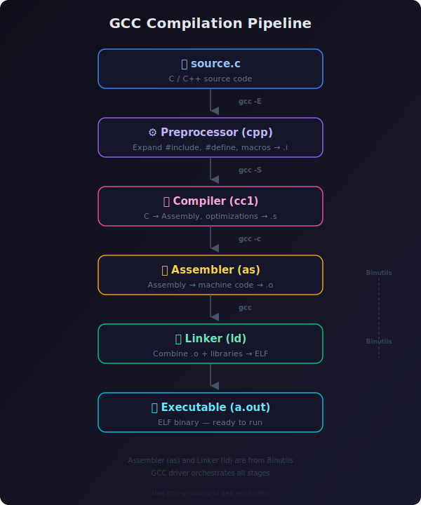

# 1. Compiling C files with gcc

Compilation is the translation of source code (the code we write) into object code (sequence of statements in machine language) by a compiler.
The compilation process has four different steps:
1. The preprocessing
2. The compiling
3. The assembling
4. The linking



The compiler we will be using as an example is `gcc` which stands for **GNU Compiler Collection**.

Gcc supports various programming languages, including C, is completely free and is the go-to compiler for most Unix-like operating systems. In order to use it, we should make sur we install it on our computer, if it’s not already there

We will take a very know c code example to explain the above four steps of compilation.

```c
#include <stdio.h>

int main() {
    printf("Hello, World!\n");
    return 0;
}
```

# 2. The Steps

NOTE 
- Refer man page of gcc to know more about the options we can pass to it.

## 1. Preprocessing
* Get rid of comments
* Expand macros
* Handle include files
* Conditional Compilation

The output of this will be stored in a file with .i extension.

```bash
gcc -E main.c -o main.i
```

## 2. Compiling
* Convert .i file to assembly language
* The assembly code is architecture specific

The preprocessed C code is translated into assembly language.
Compiler checks:
* Syntax
* Data types
* Semantic errors
* Optimizations

```bash
gcc -S main.i -o main.s
```

* `.file "main.c"`: Source file information: Used for debugging purposes
* `.text`: Code Section: Contains executable instructions
* `.rodata`: Read Only Data Section: Contains read only data like string literals
* `.LC0`: Label for the string "Hello,World"

Linux uses ELF format, a file format for executables, object code, shared libraries, and core dumps.

## 3. Assembler (as)

The assembler:

* Converts assembly instructions into machine code
* Creates ELF object file structure
* Builds symbol table
* Creates relocation entries

Organizes sections like:

* `.text`: Code Section: Contains executable instructions
* `.data`: Data Section: Contains initialized data
* `.bss`: BSS Section: Contains uninitialized data
* `.rodata`: Read Only Data Section: Contains read only data like string literals


```bash
gcc -c main.s -o main.o
```

## 4. Linker (ld)
The linker:

* Combines multiple object files into a single executable
* Resolves symbols (finds where functions and variables are defined)
* Performs relocation (updates addresses to match final layout)
* Stitches together standard libraries (libc, etc.)
* Creates the final ELF executable

### 4.1 Static Linking vs Dynamic Linking

#### Static Linking

```bash
gcc main.o -o program_static
```

* All library code is copied into the executable
* Larger executable size
* No runtime dependency on libraries
* Faster startup (no dynamic loading)
* Safer (all code is present at compile time)

#### Dynamic Linking

```bash
gcc main.o -o program_dynamic
```

* Uses shared libraries (.so files)
* Smaller executable size
* Multiple programs share library code in memory
* Easier updates (update library, all programs automatically use it)
* Slower startup (dynamic loading required)
* Dynamic linker (ld.so) resolves symbols at runtime

ELF format:

```bash
+----------------------+
| ELF Header           |
+----------------------+
| Program Headers      |
+----------------------+
| .text                |
+----------------------+
| .rodata              |
+----------------------+
| .data                |
+----------------------+
| .bss                 |
+----------------------+
| PLT                  |
+----------------------+
| GOT                  |
+----------------------+
| Dynamic Symbol Table |
+----------------------+
```

### 4.2 How Linking Works (Simplified)

Imagine:

```c
// file1.c
void print_hello();
int main() {
    print_hello();
    return 0;
}

// file2.c
void print_hello() {
    puts("Hello, World!");
}
```

**File A (main.o)**:

```assembly
main:
    call print_hello@PLT   # PLT = Procedure Linkage Table
    ret
```

**File B (print.o)**:

```assembly
.globl print_hello
print_hello:
    mov $msg, %rdi
    call puts@PLT
    ret
```

Relocation entries in each object file tell the linker:

* "I call print_hello — find where it is"
* "I use puts — I need its address from libc"

The linker:

1. Finds print_hello in print.o
2. Finds puts in libc.so
3. Updates main.o to point to the actual addresses in print.o and libc.so
4. Combines everything into a single executable

### 4.3 The Role of the Dynamic Linker

When you run a dynamically linked executable:

1. Kernel loads the executable
2. Dynamic linker (ld.so) starts

```bash
$ ldd ./program_dynamic
    linux-vdso.so.1 (0x00007ffeb694c000)
    libc.so.6 => /lib/x86_64-linux-gnu/libc.so.6 (0x00007f2836426000)
    /lib64/ld-linux-x86-64.so.2 => /lib64/ld-linux-x86-64.so.2 (0x00007f283667a000)
```

* `linux-vdso.so.1`: Kernel-provided virtual dynamic shared object (for performance)
* `libc.so.6`: The standard C library (contains puts())
* `ld-linux-x86-64.so.2`: The dynamic linker itself

3. Id.so reads the executable's NEEDED entries (which libraries it requires)
4. Id.so searches system paths (/lib, /usr/lib, LD_LIBRARY_PATH)
5. Id.so loads required libraries into memory
6. Id.so resolves all remaining symbols (the .PLT entries)
7. Control jumps to main()

This all happens in milliseconds — fast enough to be transparent.

###4.4 Default linker script

The linker script is a file that tells the linker where to place the different sections of the executable in memory. It is a text file that is written in a special syntax that is specific to the linker.

## 5. Loader (ld.so)
The dynamic loader, also known as the dynamic linker, is a small program that is loaded into memory by the kernel before your application starts. It is responsible for finding and loading all the shared libraries your application needs, resolving symbols, and connecting everything together.

```bash
$ ldd ./program_dynamic
    linux-vdso.so.1 (0x00007ffeb694c000)
    libc.so.6 => /lib/x86_64-linux-gnu/libc.so.6 (0x00007f2836426000)
    /lib64/ld-linux-x86-64.so.2 => /lib64/ld-linux-x86-64.so.2 (0x00007f283667a000)
```

```bash
$ cat /etc/ld.so.cache | grep libc
# or
$ grep libc /etc/ld.so.conf /etc/ld.so.conf.d/*
```
