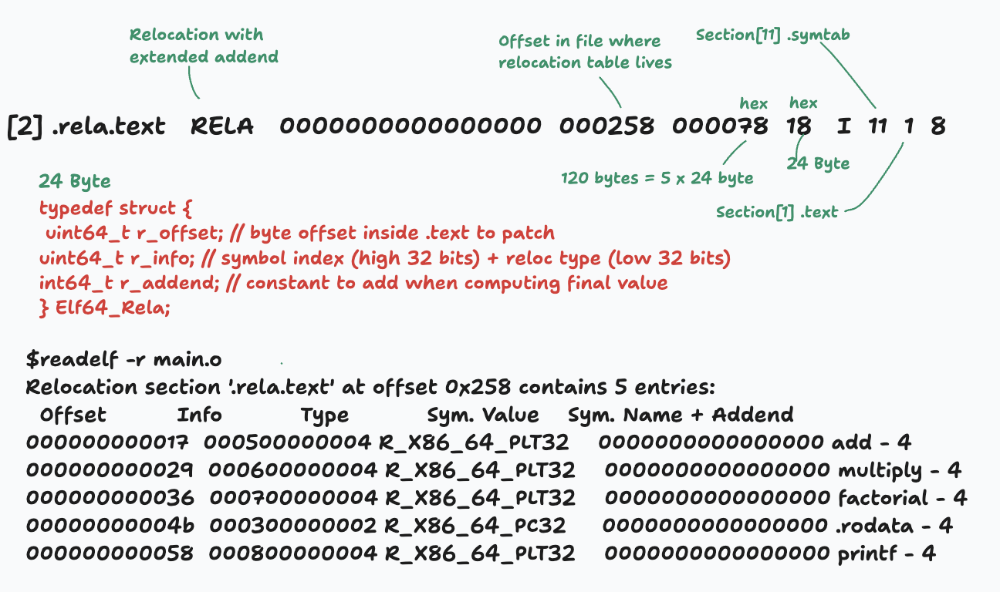
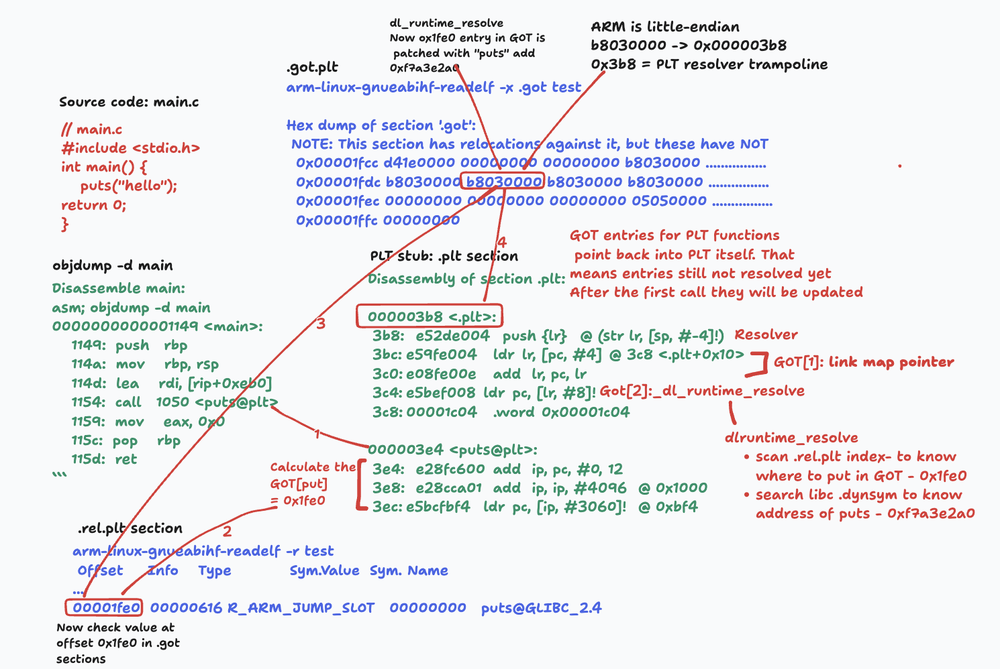

# ELF - Executable and Linkable Format
Executable and Linkable Format (ELF), is the default binary format on Linux-based systems.

Executables Shared Libraries Object Files Core dumpe Used for:
* Executables
* Shared Libraries
* Object Files(relocatable files)
* Core dumps

```bash
# Executable files
`ls`, `grep`, `gcc`, etc.

# Object code
`main.o`, `print.o`, etc.

# Shared libraries
`libc.so.6`, `libm.so.6`, etc.

# Core dumps
A snapshot of a program's memory at the time of a crash
```

## What Information is Stored in ELF?
The ELF format stores essential information about an executable file, including:

* **ELF Header**: Contains details about the ELF file such as its type, 
architecture, entry point, and program header table offset.
* **Section Header Table (SHT)**: Define various sections of the executable, 
including code, data, symbol tables, and more.
* **Program Header Table (PHT)**: Specify segments of the file, indicating which
parts should be loaded into memory.
* **Symbol Table**: Contain information about symbols in the code, aiding
in debugging and linking.

**Example**

Let's take a simple C program to understand the ELF format.

```c
#include <stdio.h>

int main() {
    printf("Hello, World!\n");
    return 0;
}
```

Now, let's compile this program and see the ELF structure.

```bash
# compile the C code
gcc -o test test.c
file test
```

Output:

```bash
test: ELF 64-bit LSB pie executable, ARM aarch64, version 1 (SYSV), dynamically linked, interpreter /lib/ld-linux-aarch64.so.1, BuildID[sha1]=cac59fe737ae3b16c4269a8d7614e50550f7addd, for GNU/Linux 3.7.0, not stripped
```

## Sections
* `Sections` are for linking (Linking View). They organize code and data into
logical chunks for the compiler and linker to process (e.g., .text for code,
`.data` for variables).
* Used by compilers and linkers.
* Defined in the `Section Header Table`.
* `.text`, `.data`, `.bss`, `.rodata`.

## Segments
* `Segments` are for execution (Execution View). They group sections together
based on memory permissions (e.g., read, write, execute) so the operating
system's loader can efficiently map them into RAM.
* Used by the OS loader.
* Defined in the `Program Header Table`.
* LOAD, DYNAMIC, INTERP, STACK

Think of segments as containers for sections. When a linker creates an executable,
it takes multiple sections with similar properties and packs them into a single
segment. For example:
* The `.text` (code) and `.rodata` (read-only data) sections are often
combined into a single loadable segment with "Read" and "Execute" permissions.
* The `.data` (initialized) and `.bss` (uninitialized) sections are combined
into a loadable segment with "Read" and "Write" permissions.

We can check this using program headers:

```bash
arm-linux-gnueabihf-readelf -l main
Program Headers:
  Type           Offset   VirtAddr   PhysAddr   FileSiz MemSiz  Flg Align
  EXIDX          0x000688 0x00000688 0x00000688 0x00008 0x00008 R   0x4
  PHDR           0x000034 0x00000034 0x00000034 0x00120 0x00120 R   0x4
  INTERP         0x000154 0x00000154 0x00000154 0x00019 0x00019 R   0x1
      [Requesting program interpreter: /lib/ld-linux-armhf.so.3]
  LOAD           0x000000 0x00000000 0x00000000 0x00694 0x00694 R E 0x1000
  LOAD           0x000ecc 0x00001ecc 0x00001ecc 0x00148 0x0014c RW  0x1000
  DYNAMIC        0x000ed4 0x00001ed4 0x00001ed4 0x000f8 0x000f8 RW  0x4

 Section to Segment mapping:
  Segment Sections...
   00     .ARM.exidx
   01
   02     .interp
   03     .interp .note.gnu.build-id .note.ABI-tag .gnu.hash .dynsym .dynstr .gnu.version .gnu
.version_r .rel.dyn .rel.plt .init .plt .text .fini .rodata .ARM.exidx .eh_frame
   04     .init_array .fini_array .dynamic .got .data .bss
   05     .dynamic
   06     .note.gnu.build-id .note.ABI-tag
   07
   08     .init_array .fini_array .dynamic .got
```

First LOAD segment contains following sections:
* .interp
* .note.gnu.build-id
* .note.ABI-tag
* .gnu.hash
* .dynsym
* .dynstr
* .gnu.version
* .gnu.version_r
* .rel.dyn
* .rel.plt
* .init
* .plt
* .text
* .fini
* .rodata
* .ARM.exidx
* .eh_frame

Second LOAD segment contains following sections:
* .init_array
* .fini_array
* .dynamic
* .got
* .data
* .bss

# Let's first understand the main components of ELF

## ELF Header
Every ELF file has an ELF header.
It specify following info:

* Magic Number: Identifies the file as an ELF file.

* What `processor` it’s designed to run on. ELF files can contain machine code
  for different processor types, like ARM and x86.

* Whether the `binary` is meant to be run on its own as an executable, or whether
  it’s meant to be loaded by other programs as a `dynamically linked library`.
  We’ll go into details about what `dynamic linking` is soon.

* The `entry point` of the executable. Later sections specify exactly where to
  load data contained in the ELF file into memory. The entry point is a memory
  address pointing to where the first machine code instruction is in memory
  after the entire process has been loaded.

The ELF header is always at the start of the file. It specifies the locations of
the `program header table` and `section header`, which can be anywhere within
the file. Those tables, in turn, point to data stored elsewhere in the file.

```bash
readelf -h main
ELF Header:
  Magic:   7f 45 4c 46 02 01 01 03 00 00 00 00 00 00 00 00 
  Class:                             ELF64
  Data:                              2's complement, little endian
  Version:                           1 (current)
  OS/ABI:                            UNIX - GNU
  ABI Version:                       0
  Type:                              EXEC (Executable file)
  Machine:                           Advanced Micro Devices X86-64
  Version:                           0x1
  Entry point address:               0x401740
  Start of program headers:          64 (bytes into file)
  Start of section headers:          783640 (bytes into file)
  Flags:                             0x0
  Size of this header:               64 (bytes)
  Size of program headers:           56 (bytes)
  Number of program headers:         10
  Size of section headers:           64 (bytes)
  Number of section headers:         28
  Section header string table index: 27

```

Reference: https://github.com/torvalds/linux/blob/master/include/uapi/linux/elf.h#L209

* ELF Header

```c
typedef struct
{
  unsigned char e_ident[EI_NIDENT]; /* Magic number and other info */
  ElfXX_Half    e_type;             /* Object file type */
  ElfXX_Half    e_machine;          /* Architecture */
  ElfXX_Word    e_version;          /* Object file version */
  ElfXX_Addr    e_entry;            /* Entry point virtual address */
  ElfXX_Off     e_phoff;            /* Program header table file offset */
  ElfXX_Off     e_shoff;            /* Section header table file offset */
  ElfXX_Word    e_flags;            /* Processor-specific flags */
  ElfXX_Half    e_ehsize;           /* ELF header size in bytes */
  ElfXX_Half    e_phentsize;        /* Program header table entry size */
  ElfXX_Half    e_phnum;            /* Program header table entry count */
  ElfXX_Half    e_shentsize;        /* Section header table entry size */
  ElfXX_Half    e_shnum;            /* Section header table entry count */
  ElfXX_Half    e_shstrndx;         /* Section header string table index */
} ElfXX_Ehdr;
```

## Program Header Table
The `program header table` is a series of entries containing specific details
for how to load and execute the binary at runtime. Each entry has a type
field that says what detail it’s specifying.

For example,

* `PT_LOAD` means it contains data that should be loaded into memory,
* `PT_NOTE` means the segment contains informational text that shouldn’t
necessarily be loaded anywhere.

Again same example from above:

```bash
readelf -l main
... 
Program Headers:
  Type           Offset   VirtAddr   PhysAddr   FileSiz MemSiz  Flg Align
  PHDR           0x000034 0x00000034 0x00000034 0x00120 0x00120 R   0x4
  INTERP         0x000154 0x00000154 0x00000154 0x00019 0x00019 R   0x1
      [Requesting program interpreter: /lib/ld-linux-armhf.so.3]
  LOAD           0x000000 0x00000000 0x00000000 0x00694 0x00694 R E 0x1000
  LOAD           0x000ecc 0x00001ecc 0x00001ecc 0x00148 0x0014c RW  0x1000
  DYNAMIC        0x000ed4 0x00001ed4 0x00001ed4 0x000f8 0x000f8 RW  0x4

Section to Segment mapping:
  Segment Sections...
   00     .ARM.exidx
   01
   02     .interp
   03     .interp .note.gnu.build-id .note.ABI-tag .gnu.hash .dynsym .dynstr .gnu.version .gnu
.version_r .rel.dyn .rel.plt .init .plt .text .fini .rodata .ARM.exidx .eh_frame
   04     .init_array .fini_array .dynamic .got .data .bss
   05     .dynamic
   06     .note.gnu.build-id .note.ABI-tag
   07
   08     .init_array .fini_array .dynamic .got
```

### Common Program Header Types

* `PT_LOAD`: This is the most common type. It indicates a segment that should be
  loaded into memory. These segments typically contain the actual code (`.text`)
  and data (`.data`, `.rodata`) of the program.
* `PT_DYNAMIC`: This segment contains dynamic linking information, such as the
  location of shared libraries and symbols.
* `PT_INTERP`: This segment specifies the path to the dynamic linker/loader
  (e.g., `/lib/ld-linux.so.2`), which is responsible for loading shared
  libraries at runtime.
* `PT_NOTE`: This segment contains miscellaneous information, such as the
  program's name and version.
* `PT_PHDR`: This segment contains the program header table itself.
* `PT_GNU_STACK`: This segment specifies the stack properties.
* `PT_GNU_EH_FRAME`: This segment contains the exception handling frame
  information.
* `PT_GNU_RELRO`: This segment specifies the relocation information.

### What info program header table provides?

* `Type`: The type of segment (e.g., `PT_LOAD`, `PT_DYNAMIC`).
* `Offset`: The offset of the segment in the file.
* `VirtAddr`: The virtual address of the segment in memory.
* `PhysAddr`: The physical address of the segment in memory.
* `FileSiz`: The size of the segment in the file.
* `MemSiz`: The size of the segment in memory.
* `Flg`: The flags of the segment (e.g., `R` for read, `W` for write, `E` for
execute).
* `Align`: The alignment of the segment in memory.

## Section Header Table
The `section header table` is a series of entries containing information about
sections. This section information is like a map, charting the data inside the
ELF file. It makes it easy for programs like `debuggers` to understand the
intended uses of different portions of the data.

This example is with static linking that is why we don't see any dynamic linking
related sections like `.interp`, `.dynamic` etc.

```bash
readelf -S main
There are 29 section headers, starting at offset 0x1aa8:

Section Headers:
  [Nr] Name              Type            Addr     Off    Size   ES Flg Lk Inf Al
  [ 0]                   NULL            00000000 000000 000000 00      0   0  0
  [ 1] .interp           PROGBITS        00000154 000154 000019 00   A  0   0  1
  [ 2] .note.gnu.bu[...] NOTE            00000170 000170 000024 00   A  0   0  4
  [ 3] .note.ABI-tag     NOTE            00000194 000194 000020 00   A  0   0  4
  [ 4] .gnu.hash         GNU_HASH        000001b4 0001b4 000018 04   A  5   0  4
  [ 5] .dynsym           DYNSYM          000001cc 0001cc 0000a0 10   A  6   3  4
  [ 6] .dynstr           STRTAB          0000026c 00026c 000093 00   A  0   0  1
  [ 7] .gnu.version      VERSYM          00000300 000300 000014 02   A  5   0  2
  [ 8] .gnu.version_r    VERNEED         00000314 000314 000030 00   A  6   1  4
  [ 9] .rel.dyn          REL             00000344 000344 000040 08   A  5   0  4
  [10] .rel.plt          REL             00000384 000384 000028 08  AI  5  21  4
  [11] .init             PROGBITS        000003ac 0003ac 00000c 00  AX  0   0  4
  [12] .plt              PROGBITS        000003b8 0003b8 000050 04  AX  0   0  4
  [13] .text             PROGBITS        00000408 000408 00013c 00  AX  0   0  4
  [14] .fini             PROGBITS        00000544 000544 000008 00  AX  0   0  4
  [15] .rodata           PROGBITS        0000054c 00054c 00013c 00   A  0   0  4
  [16] .ARM.exidx        ARM_EXIDX       00000688 000688 000008 00  AL 13   0  4
  [17] .eh_frame         PROGBITS        00000690 000690 000004 00   A  0   0  4
  [18] .init_array       INIT_ARRAY      00001ecc 000ecc 000004 04  WA  0   0  4
  [19] .fini_array       FINI_ARRAY      00001ed0 000ed0 000004 04  WA  0   0  4
  [20] .dynamic          DYNAMIC         00001ed4 000ed4 0000f8 08  WA  6   0  4
  [21] .got              PROGBITS        00001fcc 000fcc 000034 04  WA  0   0  4
  [22] .data             PROGBITS        00002000 001000 000014 00  WA  0   0  4
  [23] .bss              NOBITS          00002014 001014 000004 00  WA  0   0  1
  [24] .comment          PROGBITS        00000000 001014 00002d 01  MS  0   0  1
  [25] .ARM.attributes   ARM_ATTRIBUTES  00000000 001041 000033 00      0   0  1
  [26] .symtab           SYMTAB          00000000 001074 0006d0 10     27  84  4
  [27] .strtab           STRTAB          00000000 001744 00025d 00      0   0  1
  [28] .shstrtab         STRTAB          00000000 0019a1 000105 00      0   0  1
```

`Section headers table` gives us a summary about all the sections.

Among these sections names, let’s focus on the following ones: `.symtab & .dynsym`
to introduce the concepts of symbols in binary files, because it will be related
to the commands we will explain further: `nm` and `objdump`.

These are the tables storing the static and dynamic symbols for the binary. 
* `.symtab` is for static symbols
* `.dynsym` is for dynamic symbols

**Wait a minute, what do you mean by a symbol ?**

`Symbols` as the name suggests, are symbolic references to some `data`
or `code`, such as `global variable` or `function`. A developer uses `names`
to refer `functions` and `variables` throughout a `program`, these informations
are known as the `program's` symbolic information. But...the computer doesn't
care about `names`, our machine has an `address & offset` diet. That's why these
symbolic references gets translated in machine code into offsets and addresses.

Example:
```bash
aarch64-linux-gnu-readelf -S --wide test
There are 28 section headers, starting at offset 0x10ba8:

Section Headers:
  [Nr] Name              Type            Address          Off    Size   ES Flg Lk Inf Al
  ...
  [ 5] .dynsym           DYNSYM          00000000000002b8 0002b8 0000f0 18   A  6   3  8
  [ 6] .dynstr           STRTAB          00000000000003a8 0003a8 000092 00   A  0   0  1 << String table for .dynsym
  ...
  [25] .symtab           SYMTAB          0000000000000000 010040 000840 18     26  65  8
  [26] .strtab           STRTAB          0000000000000000 010880 00022c 00      0   0  1 << String table for .symtab
  ...
  
Key to Flags:
  W (write), A (alloc), X (execute), M (merge), S (strings), I (info),
  L (link order), O (extra OS processing required), G (group), T (TLS),
  C (compressed), x (unknown), o (OS specific), E (exclude),
  D (mbind), p (processor specific)
```
`dynsym` flag `A` for alloc means it will be allocates at runtime and loaded in
memory but `symtab` flag is not `A` allocated and hence not loaded in memory.

**A single ELF file may contain a maximum of two symbol tables: `.symtab` and
`.dynsym`**

### Section details

In this section we will be covering all the `sections` in an ELF file.

| Badge | Meaning |
|---|---|
| `OBJ` | Object file (`.o`) |
| `EXE` | Executable / shared library |
| `STA` | Static linking |
| `DYN` | Dynamic linking |
| `ALL` | All ELF files |

---

## Core Sections (Code & Data)

| Section | What it stores | Notes | Relevant to |
|---|---|---|---|
| `.text` | Compiled machine code — actual CPU instructions | Read-only, executable. Entry point (`_start`/`main`) lives here | `OBJ` `EXE` `STA` |
| `.data` | Initialized global/static variables (e.g. `int x = 5;`) | Read-write. Values stored literally in the file, loaded into memory | `OBJ` `EXE` `STA` |
| `.bss` | Uninitialized global/static variables (e.g. `int arr[1000];`) | Takes **no space** in the file — OS zero-fills on load. Only size is stored | `OBJ` `EXE` `STA` |
| `.rodata` | Read-only data: string literals, `const` arrays, jump tables | Mapped read-only. Typically shared across processes | `OBJ` `EXE` `STA` |

---

## Symbol & String Tables

| Section | What it stores | Notes | Relevant to |
|---|---|---|---|
| `.symtab` | Every function/variable name with address, size, and binding (local/global/weak) | Required by the linker. Stripped from release executables | `OBJ` `STA` |
| `.strtab` | Null-terminated symbol names for `.symtab`, packed end-to-end | Symbols reference byte offsets into this section. Stripped in release | `OBJ` `STA` |

---

## Relocation Sections (Compile-time)

| Section | What it stores | Notes | Relevant to |
|---|---|---|---|
| `.rel.text` / `.rela.text` | Patches the linker applies to `.text` — calls/jumps with unknown targets | `.rel` = no addend, `.rela` = with addend. Resolved and removed after linking | `OBJ` `STA` |
| `.rel.data` / `.rela.data` | Patches to `.data` — global pointer initializers referencing other symbols | Same mechanics as `.rel.text`, applied to data addresses | `OBJ` `STA` |

---

## Dynamic Linking Sections

| Section | What it stores | Notes | Relevant to |
|---|---|---|---|
| `.dynamic` | Dynamic linker manifest: needed `.so` files, GOT/PLT addresses, RPATH | Read by `ld.so` at load time. Only in dynamically linked executables/libs | `EXE` `DYN` |
| `.dynsym` | Reduced symbol table — only symbols exported or imported at runtime | Subset of `.symtab`. Survives `strip`. Essential for runtime resolution | `EXE` `DYN` |
| `.dynstr` | String table for `.dynsym` — symbol names and library filenames (e.g. `libc.so.6`) | Paired with `.dynsym`. Also survives `strip` | `EXE` `DYN` |
| `.got` | Global Offset Table — writable pointer array for global variable addresses | Enables position-independent code. Filled at load time | `EXE` `DYN` |
| `.got.plt` | GOT slots for function addresses, resolved lazily by the PLT | Initially points back into the PLT resolver; patched on first call | `EXE` `DYN` |
| `.plt` | Procedure Linkage Table — one stub per imported function | First call triggers `ld.so` resolution; subsequent calls jump direct via GOT | `EXE` `DYN` |
| `.hash` / `.gnu.hash` | Hash table over `.dynsym` for O(1) symbol lookup at runtime | `.gnu.hash` is the modern variant with a Bloom filter — preferred on Linux | `EXE` `DYN` |
| `.rela.dyn` | Runtime relocations for data/GOT entries | Applied by `ld.so` at load time | `EXE` `DYN` |
| `.rela.plt` | Runtime relocations for PLT GOT slots | Applied lazily by `ld.so` on first call | `EXE` `DYN` |
| `.interp` | Path to the dynamic linker, e.g. `/lib64/ld-linux-x86-64.so.2` | Kernel reads this to know which loader to invoke. Absent in static executables | `EXE` `DYN` |
| `.tdata` / `.tbss` | Thread-Local Storage: initialized (`.tdata`) and uninitialized (`.tbss`) TLS vars | Each thread gets its own copy. Used with `__thread` / `thread_local` | `EXE` `DYN` |

---

## Initialization & Finalization

| Section | What it stores | Notes | Relevant to |
|---|---|---|---|
| `.init` / `.fini` | Code run before `main()` and after exit | C++ constructors and `__attribute__((constructor))` hooks land here | `EXE` `ALL` |
| `.init_array` / `.fini_array` | Arrays of function pointers called at startup and shutdown | Modern replacement for `.ctors`/`.dtors`. Linker collects all ctor/dtor pointers here | `EXE` `ALL` |

---

## Debug Sections

| Section | What it stores | Notes | Relevant to |
|---|---|---|---|
| `.debug_info` | Types, variables, and compilation unit metadata (DWARF) | Main DWARF section. Emitted with `-g` | `OBJ` `EXE` |
| `.debug_line` | Source file ↔ address mapping (line number table) | Used by debuggers to map crashes back to source lines | `OBJ` `EXE` |
| `.debug_abbrev` | Abbreviation table describing `.debug_info` encoding | Required to parse `.debug_info` | `OBJ` `EXE` |
| `.debug_str` | String pool for debug info (type names, file paths, etc.) | Deduplicated strings referenced by offset from `.debug_info` | `OBJ` `EXE` |

> All `.debug_*` sections are stripped in release builds. Can be split to a sidecar file: `objcopy --only-keep-debug binary binary.debug`

---

## Metadata & Housekeeping

| Section | What it stores | Notes | Relevant to |
|---|---|---|---|
| `.shstrtab` | Names of all sections (`.text`, `.data`, …) as null-terminated strings | Every ELF has exactly one. `e_shstrndx` in the ELF header points to it | `ALL` |
| `.note.gnu.build-id` | Unique build hash (SHA-1 or MD5 of the binary) | Used by crash reporters to locate the right debug symbols | `EXE` `ALL` |
| `.note.ABI-tag` | Minimum kernel version the binary requires | Checked by the loader before executing | `EXE` `ALL` |
| `.note.gnu.property` | CPU feature requirements (e.g. Intel CET, ARM BTI) | Used by the kernel to enable hardware security features | `EXE` `ALL` |

---

## Scenario Summary

| Scenario | Key sections present | Key sections absent |
|---|---|---|
| **Object file** (`.o`, `gcc -c`) | `.text` `.data` `.bss` `.rodata` `.symtab` `.strtab` `.rela.text` `.rela.data` | `.got` `.plt` `.dynamic` `.interp` |
| **Static executable** (`gcc`, no `-shared`) | `.text` `.data` `.bss` `.rodata` `.init_array` `.fini_array` | `.dynamic` `.interp` `.got.plt` `.plt` `.dynsym` |
| **Dynamic executable** (`gcc` default) | All static sections + `.interp` `.dynamic` `.dynsym` `.dynstr` `.got` `.got.plt` `.plt` `.rela.dyn` `.rela.plt` `.gnu.hash` | `.symtab` (if stripped), `.rel.*` (resolved) |
| **Shared library** (`.so`, `gcc -shared`) | Same as dynamic executable minus `.interp` | `.interp` |
| **Debug build** (any + `-g`) | All of the above + `.debug_info` `.debug_line` `.debug_abbrev` `.debug_str` | — |
| **Release / stripped** | Executable sections only | `.symtab` `.strtab` `.debug_*` |


# ELF Linking

Linking is the process of combining object files and libraries into a single
executable file.

## Types of linking

1. Static Linking

Static linking occurs entirely at build time.
The linker (ld) collects all required object files and libraries, merges their 
symbol tables, applies relocations, and produces a single self-contained binary.
Everything it needs is embedded which means faster startup, but larger 
executables and harder updates.

2. Dynamic Linking

Dynamic linking, on the other hand, leaves part of this work deferred until
runtime.
The compiler embeds references to shared libraries instead of including their code
directly.

When the program starts, the dynamic linker/loader (commonly ld-linux.so on
Linux) maps these shared libraries into memory and connects their symbols to the
main program.

## ELF - Static Linking

We are taking two files `main.c` and `math_utils.c` as input.

**main.c**
```c
cat main.c
#include <stdio.h>
#include "math_utils.h"
int main() {
 int x = add(3, 4);
 int y = multiply(x, 2);
 int z = factorial(5);
 printf("add: %d, mul: %d, factorial: %d\n", x, y, z);
 return 0;
}
```

**math_utils.c**
```c
#include "math_utils.h"
int add(int a, int b) {
 return a + b;
}
int multiply(int a, int b) {
 return a * b;
}
int factorial(int n) {
 if (n <= 1)
	 return 1; 
return n * multiply(n, factorial(n - 1));
}
```

**math_utils.h**
```c
cat math_utils.h 
#ifndef MATH_UTILS_H
 #define MATH_UTILS_H
 int add(int a, int b);
 int multiply(int a, int b);
 int factorial(int n);
#endif
```

### Stage 1 — Compile to object files

* Compile each source file into an object file

```bash
gcc -c main.c -o main.o
gcc -c math_utils.c -o math_utils.o
```

* We can use `nm` to see the symbol table of `main.o`. here `add`, `factorial`
and `printf` are undefined symbols.

```bash
nm main.o
                 U add
                 U factorial
0000000000000000 T main
                 U multiply
                 U printf

```

* Symbol table of `math_utils.o`. Here `add`, `multiply` and `factorial` are
defined symbols.

```bash
nm math_utils.o
0000000000000000 T add
0000000000000020 T factorial
0000000000000010 T multiply
```

* Section headers of `main.o`

```bash
readelf -S --wide main.o
There are 14 section headers, starting at offset 0x360:

Section Headers:
  [Nr] Name              Type            Address          Off    Size   ES Flg Lk Inf Al
  [ 0]                   NULL            0000000000000000 000000 000000 00      0   0  0
  [ 1] .text             PROGBITS        0000000000000000 000040 000063 00  AX  0   0  1
  [ 2] .rela.text        RELA            0000000000000000 000258 000078 18   I 11   1  8
  [ 3] .data             PROGBITS        0000000000000000 0000a3 000000 00  WA  0   0  1
  [ 4] .bss              NOBITS          0000000000000000 0000a3 000000 00  WA  0   0  1
  [ 5] .rodata           PROGBITS        0000000000000000 0000a8 000021 00   A  0   0  8
  [ 6] .comment          PROGBITS        0000000000000000 0000c9 00002e 01  MS  0   0  1
  [ 7] .note.GNU-stack   PROGBITS        0000000000000000 0000f7 000000 00      0   0  1
  [ 8] .note.gnu.property NOTE            0000000000000000 0000f8 000020 00   A  0   0  8
  [ 9] .eh_frame         PROGBITS        0000000000000000 000118 000038 00   A  0   0  8
  [10] .rela.eh_frame    RELA            0000000000000000 0002d0 000018 18   I 11   9  8
  [11] .symtab           SYMTAB          0000000000000000 000150 0000d8 18     12   4  8
  [12] .strtab           STRTAB          0000000000000000 000228 00002b 00      0   0  1
  [13] .shstrtab         STRTAB          0000000000000000 0002e8 000074 00      0   0  1
Key to Flags:
  W (write), A (alloc), X (execute), M (merge), S (strings), I (info),
  L (link order), O (extra OS processing required), G (group), T (TLS),
  C (compressed), x (unknown), o (OS specific), E (exclude),
  D (mbind), l (large), p (processor specific)
```

Understand this line first:
```
[2] .rela.text   RELA   0000000000000000  000258  000078  18   I  11  1  8
```

* Type: `RELA` - Relocations with explicit addend (vs REL which encodes addend
in the instruction)
* Offset in file: `0x258` - Where the relocation table lives in main.o
* Size: `0x78` = 120 bytes - 5 entries × 24 bytes each (ES = 18 hex = 24)
* Lk = 11: → section [11] - Linked symbol table is .symtab — look up symbols
here
* Inf = 1: → section [1] - These relocations apply to .text

### Stage 2 — Relocation entries(.rela.text)

* `.rela.text` is the relocation section of `main.o` and it contains the
relocation entries for the `.text` section of `main.o`. Linker will use this
section to resolve the symbols in the `.text` section of `main.o`

* Relocation section of `main.o`




**Example: call to add**

`Offset: 0x17   Info: 000500000004   Type: R_X86_64_PLT32   Sym: add   Addend: -4`


**FieldDecoded**
* `r_offset = 0x17`
  * Patch the 4 bytes at offset 0x17 inside .text
* `Symbol index = 0x05`
  * Entry 5 in .symtab → symbol add
* `Type = R_X86_64_PLT32`
  * PC-relative 32-bit, via PLT if needed
* `Addend = -4`
  * Standard x86-64 adjustment (see below)

**Formula the linker applies:**
`patch_value = S + A - P`
* `S` = final address of symbol `add`
* `A` = addend = -4
* `P` = address of the 4-byte slot being patched (0x17 in .text, relocated)

**Disassembly of main.o**

```bash
objdump -dr main.o

0000000000000000 <main>:
   0:	f3 0f 1e fa          	endbr64
...
  11:	bf 03 00 00 00       	mov    $0x3,%edi
  16:	e8 00 00 00 00       	call   1b <main+0x1b>
			17: R_X86_64_PLT32	add-0x4
...
  28:	e8 00 00 00 00       	call   2d <main+0x2d>
			29: R_X86_64_PLT32	multiply-0x4
...
  35:	e8 00 00 00 00       	call   3a <main+0x3a>
			36: R_X86_64_PLT32	factorial-0x4
...
  48:	48 8d 05 00 00 00 00 	lea    0x0(%rip),%rax        # 4f <main+0x4f>
			4b: R_X86_64_PC32	.rodata-0x4
...
  57:	e8 00 00 00 00       	call   5c <main+0x5c>
			58: R_X86_64_PLT32	printf-0x4

```

### Stage 3 — Static Linking

```bash
gcc -static -o myprog main.o math_utils.o
```
What the linker (ld, invoked by gcc) does, in order:

* `Merges sections` — all .text segments are concatenated into one big .text;
  same for .data, .rodata, .bss.

* `Assigns virtual addresses` — starting at 0x400000 (x86-64 default), it lays out
  the merged sections.

* `Resolves symbols` — now that every object is in one address space, add has
  a real address (say 0x401234). It fills in the symbol table.

* `Applies relocations` — goes back to every R_X86_64_PLT32 record in main.o and
patches the machine code with the actual address difference.

```bash
ldd main-static 
	not a dynamic executable
```
No dependencies on shared libraries.

#### Program headers of static executable

```bash
readelf -l --wide main-static

Elf file type is EXEC (Executable file)
Entry point 0x401740
There are 10 program headers, starting at offset 64

Program Headers:
  Type           Offset   VirtAddr           PhysAddr           FileSiz  MemSiz   Flg Align
  LOAD           0x000000 0x0000000000400000 0x0000000000400000 0x0004f8 0x0004f8 R   0x1000
  LOAD           0x001000 0x0000000000401000 0x0000000000401000 0x07d7cd 0x07d7cd R E 0x1000
  LOAD           0x07f000 0x000000000047f000 0x000000000047f000 0x0257fc 0x0257fc R   0x1000
  LOAD           0x0a4f50 0x00000000004a5f50 0x00000000004a5f50 0x005b60 0x00b2d8 RW  0x1000
  NOTE           0x000270 0x0000000000400270 0x0000000000400270 0x000030 0x000030 R   0x8
  NOTE           0x0002a0 0x00000000004002a0 0x00000000004002a0 0x000044 0x000044 R   0x4
  TLS            0x0a4f50 0x00000000004a5f50 0x00000000004a5f50 0x000018 0x000058 R   0x8
  GNU_PROPERTY   0x000270 0x0000000000400270 0x0000000000400270 0x000030 0x000030 R   0x8
  GNU_STACK      0x000000 0x0000000000000000 0x0000000000000000 0x000000 0x000000 RW  0x10
  GNU_RELRO      0x0a4f50 0x00000000004a5f50 0x00000000004a5f50 0x0040b0 0x0040b0 R   0x1

 Section to Segment mapping:
  Segment Sections...
   00     .note.gnu.property .note.gnu.build-id .note.ABI-tag .rela.plt 
   01     .init .plt .text .fini 
   02     .rodata .stapsdt.base rodata.cst32 .eh_frame .gcc_except_table 
   03     .tdata .init_array .fini_array .data.rel.ro .got .got.plt .data .bss 
   04     .note.gnu.property 
   05     .note.gnu.build-id .note.ABI-tag 
   06     .tdata .tbss 
   07     .note.gnu.property 
   08     
   09     .tdata .init_array .fini_array .data.rel.ro .got
```

#### Section headers of static executable

```bash
readelf -S --wide main-static
There are 28 section headers, starting at offset 0xbf518:

Section Headers:
  [Nr] Name              Type            Address          Off    Size   ES Flg Lk Inf Al
  [ 0]                   NULL            0000000000000000 000000 000000 00      0   0  0
  [ 1] .note.gnu.property NOTE            0000000000400270 000270 000030 00   A  0   0  8
  [ 2] .note.gnu.build-id NOTE            00000000004002a0 0002a0 000024 00   A  0   0  4
  [ 3] .note.ABI-tag     NOTE            00000000004002c4 0002c4 000020 00   A  0   0  4
  [ 4] .rela.plt         RELA            00000000004002e8 0002e8 000210 18  AI  0  20  8
  [ 5] .init             PROGBITS        0000000000401000 001000 00001b 00  AX  0   0  4
  [ 6] .plt              PROGBITS        0000000000401020 001020 000160 00  AX  0   0 16
  [ 7] .text             PROGBITS        0000000000401180 001180 07d640 00  AX  0   0 64
  [ 8] .fini             PROGBITS        000000000047e7c0 07e7c0 00000d 00  AX  0   0  4
  [ 9] .rodata           PROGBITS        000000000047f000 07f000 01c1c4 00   A  0   0 32
  [10] .stapsdt.base     PROGBITS        000000000049b1c4 09b1c4 000001 00   A  0   0  1
  [11] rodata.cst32      PROGBITS        000000000049b1e0 09b1e0 000060 20  AM  0   0 32
  [12] .eh_frame         PROGBITS        000000000049b240 09b240 0094e0 00   A  0   0  8
  [13] .gcc_except_table PROGBITS        00000000004a4720 0a4720 0000dc 00   A  0   0  1
  [14] .tdata            PROGBITS        00000000004a5f50 0a4f50 000018 00 WAT  0   0  8
  [15] .tbss             NOBITS          00000000004a5f68 0a4f68 000040 00 WAT  0   0  8
  [16] .init_array       INIT_ARRAY      00000000004a5f68 0a4f68 000008 08  WA  0   0  8
  [17] .fini_array       FINI_ARRAY      00000000004a5f70 0a4f70 000010 08  WA  0   0  8
  [18] .data.rel.ro      PROGBITS        00000000004a5f80 0a4f80 003fc8 00  WA  0   0 32
  [19] .got              PROGBITS        00000000004a9f48 0a8f48 000090 00  WA  0   0  8
  [20] .got.plt          PROGBITS        00000000004a9fe8 0a8fe8 0000c8 08  WA  0   0  8
  [21] .data             PROGBITS        00000000004aa0c0 0a90c0 0019f0 00  WA  0   0 32
  [22] .bss              NOBITS          00000000004abac0 0aaab0 005768 00  WA  0   0 32
  [23] .comment          PROGBITS        0000000000000000 0aaab0 00002d 01  MS  0   0  1
  [24] .note.stapsdt     NOTE            0000000000000000 0aaae0 0015a0 00      0   0  4
  [25] .symtab           SYMTAB          0000000000000000 0ac080 00bc28 18     26 712  8
  [26] .strtab           STRTAB          0000000000000000 0b7ca8 007763 00      0   0  1
  [27] .shstrtab         STRTAB          0000000000000000 0bf40b 00010c 00      0   0  1
```

#### Symbol table of static executable

```bash
readelf -s main-static 

Symbol table '.symtab' contains 2007 entries:
   Num:    Value          Size Type    Bind   Vis      Ndx Name
     0: 0000000000000000     0 NOTYPE  LOCAL  DEFAULT  UND 
     1: 0000000000000000     0 FILE    LOCAL  DEFAULT  ABS crt1.o
     2: 00000000004002c4    32 OBJECT  LOCAL  DEFAULT    3 __abi_tag
     3: 0000000000000000     0 FILE    LOCAL  DEFAULT  ABS libc_fatal.o
     4: 0000000000401180     5 FUNC    LOCAL  DEFAULT    7 __libc_message_i[...]
     5: 0000000000000000     0 FILE    LOCAL  DEFAULT  ABS loadmsgcat.o
     6: 00000000004b0dd0    16 OBJECT  LOCAL  DEFAULT   22 lock.0
     7: 0000000000401192     5 FUNC    LOCAL  DEFAULT    7 _nl_load_domain.cold
     8: 0000000000000000     0 FILE    LOCAL  DEFAULT  ABS abort.o
     9: 00000000004b0e30    16 OBJECT  LOCAL  DEFAULT   22 lock
    10: 00000000004b0e40     4 OBJECT  LOCAL  DEFAULT   22 stage
    11: 0000000000000000     0 FILE    LOCAL  DEFAULT  ABS printf_fp.o
    12: 0000000000439290   308 FUNC    LOCAL  DEFAULT    7 hack_digit
    13: 00000000004393d0  8439 FUNC    LOCAL  DEFAULT    7 __printf_fp_buff[...]
...
#This file is big becasue it contains all the symbols of libc
```

## ELF — Dynamic Linking

Dynamic linking defers all symbol resolution to runtime. Instead of baking
library code into the binary, the executable records what it needs and lets
the dynamic linker (ld.so) wire everything up when the process starts — or
even lazily on the first call.

### The Role of the Dynamic Linker
At **compile time**, the linker records which shared libraries and symbols the
program needs, but doesn't copy the code in. The resulting binary is smaller
and contains just the references.

At **run time**, the dynamic linker (ld.so) resolves all the symbols and applies
relocations. It maps all the required shared libraries into memory and patches
the binary with the actual memory addresses of those functions and variables.

When the operating system loads a dynamically linked executable, it performs
three major steps:

1. Mapping shared objects into memory

Each required .so file (shared object) is located through search paths
(like /lib, /usr/lib, or LD_LIBRARY_PATH).

2. Resolving symbols and applying relocations

Every function or global variable used but not defined in the main program must
be resolved in one of the shared libraries. The dynamic linker reads relocation
entries from the ELF (Executable and Linkable Format) headers and patches the
binary with the actual memory addresses of those functions and variables.

3. Relocation table patching and PLT/GOT updates

Calls to external functions in dynamically linked code are not direct jumps.
Instead, they go through two structures:

### Step 1 — Build a shared library

```bash
# -fPIC: Position-Independent Code — required for shared libs
gcc -fPIC -c math_utils.c -o math_utils.o

# -shared: produce a .so instead of an executable
# -Wl,-soname: embed the canonical name the loader uses
gcc -shared -Wl,-soname,libmath.so.1 -o libmath.so.1.0 math_utils.o
ln -s libmath.so.1.0 libmath.so.1   # version symlink
ln -s libmath.so.1   libmath.so     # linker symlink
```

### Step 2 — Link the executable against it

```bash
gcc -o myprog main.c -L. -lmath -Wl,-rpath,'$ORIGIN'
```
The `-lmath` flag tells the linker to look for `libmath.so` (not `libmath.a`).
The binary records the dependency but does not copy any code from it.

### Key ELF sections involved

| Section:            | Purpose                              |
|---------------------|--------------------------------------|
| .dynamic            | List of needed libraries, symbol tables, etc. |
| .plt                | Stubs that jump through the GOT |
| .got.plt            | Pointer table patched by the dynamic linker |
| .dynsym             | Exported/imported symbol names and types |

### Library search order (Linux)

* `RPATH` embedded in the binary
* `LD_LIBRARY_PATH` environment variable
* `RUNPATH` embedded in the binary
* `/etc/ld.so.cache` (built from `/etc/ld.so.conf`)
* `/lib`, `/usr/lib`

### Useful diagnostic tools

* `ldd myapp`                  # show shared library dependencies
* `readelf -d myapp`           # dump `.dynamic` section
* `objdump -p myapp`           # similar, more readable
* `nm -D libfoo.so`            # list dynamic symbols
* `LD_DEBUG=all ./myapp`       # trace every linker decision at runtime
* `patchelf --set-rpath ...`   # modify rpath after the fact

```bash
ldd main-dynamic 
	linux-vdso.so.1 (0x00007ffdcb2f9000)
	libmath.so.1 => /home/aojha/Practice/ELF/dynamic-linking/./libmath.so.1 (0x00007bb36abca000)
	libc.so.6 => /lib/x86_64-linux-gnu/libc.so.6 (0x00007bb36a800000)
	/lib64/ld-linux-x86-64.so.2 (0x00007bb36abd6000)
```

```bash
 readelf -d main-dynamic |grep -E "(NEEDED|RUNPATH)"
 0x0000000000000001 (NEEDED)             Shared library: [libmath.so.1]
 0x0000000000000001 (NEEDED)             Shared library: [libc.so.6]
 0x000000000000001d (RUNPATH)            Library runpath: [$ORIGIN]
```

```bash
 objdump -p main-dynamic |grep -E "(NEEDED|RUNPATH)"
  NEEDED               libmath.so.1
  NEEDED               libc.so.6
  RUNPATH              $ORIGIN
```

```bash
nm -D libmath.so
0000000000001119 T add
                 w __cxa_finalize
0000000000001148 T factorial
                 w __gmon_start__
                 w _ITM_deregisterTMCloneTable
                 w _ITM_registerTMCloneTable
0000000000001131 T multiply
```

* Here is how the dynamic linker loads and links the libraries

```bash
LD_DEBUG=all ./main-dynamic 
....	
# Find libmath.so.1
   2352225:	file=libmath.so.1 [0];  needed by ./main-dynamic [0]
   2352225:	find library=libmath.so.1 [0]; searching
   2352225:	 search path=/home/aojha/Practice/ELF/dynamic-linking		(RUNPATH from file ./main-dynamic)
   2352225:	  trying file=/home/aojha/Practice/ELF/dynamic-linking/libmath.so.1
   2352225:	
   2352225:	file=libmath.so.1 [0];  generating link map
   2352225:	  dynamic: 0x000073fa39de1e38  base: 0x000073fa39dde000   size: 0x0000000000004018
   2352225:	    entry: 0x000073fa39dde000  phdr: 0x000073fa39dde040  phnum:                 11
...	
# Find libc.so.6
   2352225:	file=libc.so.6 [0];  needed by ./main-dynamic [0]
   2352225:	find library=libc.so.6 [0]; searching
   2352225:	 search path=/home/aojha/Practice/ELF/dynamic-linking		(RUNPATH from file ./main-dynamic)
   2352225:	  trying file=/home/aojha/Practice/ELF/dynamic-linking/libc.so.6
   2352225:	 search cache=/etc/ld.so.cache
   2352225:	  trying file=/lib/x86_64-linux-gnu/libc.so.6
   2352225:	
   2352225:	file=libc.so.6 [0];  generating link map
   2352225:	  dynamic: 0x000073fa39c02940  base: 0x000073fa39a00000   size: 0x0000000000211d90
   2352225:	    entry: 0x000073fa39a2a390  phdr: 0x000073fa39a00040  phnum:                 14
   2352225:

# Version checking for libc.so.6	
   2352225:	checking for version `GLIBC_2.2.5' in file libc.so.6 [0] required by ./main-dynamic [0]

# Relocation processing and symbol resolution

# Example: _res symbol resolution
   2352225:	relocation processing: libc.so.6
   2352225:	symbol=_res;  lookup in file=./main-dynamic [0]
   2352225:	symbol=_res;  lookup in file=/home/aojha/Practice/ELF/dynamic-linking/libmath.so.1 [0]
   2352225:	symbol=_res;  lookup in file=/lib/x86_64-linux-gnu/libc.so.6 [0]
   2352225:	binding file /lib/x86_64-linux-gnu/libc.so.6 [0] to /lib/x86_64-linux-gnu/libc.so.6 [0]: normal symbol `_res' [GLIBC_2.2.5]

# Example: svc_max_pollfd symbol resolution
   2352225:	symbol=svc_max_pollfd;  lookup in file=./main-dynamic [0]
   2352225:	symbol=svc_max_pollfd;  lookup in file=/home/aojha/Practice/ELF/dynamic-linking/libmath.so.1 [0]
   2352225:	symbol=svc_max_pollfd;  lookup in file=/lib/x86_64-linux-gnu/libc.so.6 [0]
   2352225:	binding file /lib/x86_64-linux-gnu/libc.so.6 [0] to /lib/x86_64-linux-gnu/libc.so.6 [0]: normal symbol `svc_max_pollfd' [GLIBC_2.2.5]
   

# Example: __ctype_toupper symbol resolution
   2352225:	symbol=__ctype_toupper;  lookup in file=./main-dynamic [0]
   2352225:	symbol=__ctype_toupper;  lookup in file=/home/aojha/Practice/ELF/dynamic-linking/libmath.so.1 [0]
   2352225:	symbol=__ctype_toupper;  lookup in file=/lib/x86_64-linux-gnu/libc.so.6 [0]
   2352225:	binding file /lib/x86_64-linux-gnu/libc.so.6 [0] to /lib/x86_64-linux-gnu/libc.so.6 [0]: normal symbol `__ctype_toupper' [GLIBC_2.2.5]
   
   # Example: loc1 symbol resolution
   2352225:	symbol=loc1;  lookup in file=./main-dynamic [0]
   2352225:	symbol=loc1;  lookup in file=/home/aojha/Practice/ELF/dynamic-linking/libmath.so.1 [0]
   2352225:	symbol=loc1;  lookup in file=/lib/x86_64-linux-gnu/libc.so.6 [0]
   2352225:	binding file /lib/x86_64-linux-gnu/libc.so.6 [0] to /lib/x86_64-linux-gnu/libc.so.6 [0]: normal symbol `loc1' [GLIBC_2.2.5]

   # Example: __ctype32_toupper symbol resolution
   2352225:	symbol=__ctype32_toupper;  lookup in file=./main-dynamic [0]
   2352225:	symbol=__ctype32_toupper;  lookup in file=/home/aojha/Practice/ELF/dynamic-linking/libmath.so.1 [0]
   2352225:	symbol=__ctype32_toupper;  lookup in file=/lib/x86_64-linux-gnu/libc.so.6 [0]
   2352225:	binding file /lib/x86_64-linux-gnu/libc.so.6 [0] to /lib/x86_64-linux-gnu/libc.so.6 [0]: normal symbol `__ctype32_toupper' [GLIBC_2.2.5]
...
# Now looking for symbols in libmath.so.1
# symbol add
   2352225:	symbol=add;  lookup in file=./main-dynamic [0]
   2352225:	symbol=add;  lookup in file=/home/aojha/Practice/ELF/dynamic-linking/libmath.so.1 [0]
   2352225:	binding file ./main-dynamic [0] to /home/aojha/Practice/ELF/dynamic-linking/libmath.so.1 [0]: normal symbol `add'

# symbol multiply
   2352225:	symbol=multiply;  lookup in file=./main-dynamic [0]
   2352225:	symbol=multiply;  lookup in file=/home/aojha/Practice/ELF/dynamic-linking/libmath.so.1 [0]
   2352225:	binding file ./main-dynamic [0] to /home/aojha/Practice/ELF/dynamic-linking/libmath.so.1 [0]: normal symbol `multiply'

# symbol factorial
   2352225:	symbol=factorial;  lookup in file=./main-dynamic [0]
   2352225:	symbol=factorial;  lookup in file=/home/aojha/Practice/ELF/dynamic-linking/libmath.so.1 [0]
   2352225:	binding file ./main-dynamic [0] to /home/aojha/Practice/ELF/dynamic-linking/libmath.so.1 [0]: normal symbol `factorial'

# symbol printf
   2352225:	symbol=printf;  lookup in file=./main-dynamic [0]
   2352225:	symbol=printf;  lookup in file=/home/aojha/Practice/ELF/dynamic-linking/libmath.so.1 [0]
   2352225:	symbol=printf;  lookup in file=/lib/x86_64-linux-gnu/libc.so.6 [0]
   2352225:	binding file ./main-dynamic [0] to /lib/x86_64-linux-gnu/libc.so.6 [0]: normal symbol `printf' [GLIBC_2.2.5]

# Call initialization functions
   2352225:	calling init: /lib64/ld-linux-x86-64.so.2	
   2352225:	calling init: /lib/x86_64-linux-gnu/libc.so.6	
   2352225:	calling init: /home/aojha/Practice/ELF/dynamic-linking/libmath.so.1
   2352225:	initialize program: ./main-dynamic	
   2352225:	transferring control: ./main-dynamic

# Run the program
   2352225:	symbol=multiply;  lookup in file=./main-dynamic [0]
   2352225:	symbol=multiply;  lookup in file=/home/aojha/Practice/ELF/dynamic-linking/libmath.so.1 [0]
   2352225:	binding file /home/aojha/Practice/ELF/dynamic-linking/libmath.so.1 [0] to /home/aojha/Practice/ELF/dynamic-linking/libmath.so.1 [0]: normal symbol `multiply'

# Output
add: 7, mul: 14, factorial: 14400

# Call fini functions
   2352225:	calling fini:  [0]
   2352225:	calling fini: /home/aojha/Practice/ELF/dynamic-linking/libmath.so.1 [0]
   2352225:	calling fini: /lib/x86_64-linux-gnu/libc.so.6 [0]
   2352225:	calling fini: /lib64/ld-linux-x86-64.so.2 [0]

```

#### Program header of dynamic executable

```bash
readelf -l --wide main-dynamic

Elf file type is DYN (Position-Independent Executable file)
Entry point 0x10c0
There are 13 program headers, starting at offset 64

Program Headers:
  Type           Offset   VirtAddr           PhysAddr           FileSiz  MemSiz   Flg Align
  PHDR           0x000040 0x0000000000000040 0x0000000000000040 0x0002d8 0x0002d8 R   0x8
  INTERP         0x000318 0x0000000000000318 0x0000000000000318 0x00001c 0x00001c R   0x1
      [Requesting program interpreter: /lib64/ld-linux-x86-64.so.2]
  LOAD           0x000000 0x0000000000000000 0x0000000000000000 0x0006e8 0x0006e8 R   0x1000
  LOAD           0x001000 0x0000000000001000 0x0000000000001000 0x000219 0x000219 R E 0x1000
  LOAD           0x002000 0x0000000000002000 0x0000000000002000 0x00010c 0x00010c R   0x1000
  LOAD           0x002d80 0x0000000000003d80 0x0000000000003d80 0x000290 0x000298 RW  0x1000
  DYNAMIC        0x002d90 0x0000000000003d90 0x0000000000003d90 0x000210 0x000210 RW  0x8
  NOTE           0x000338 0x0000000000000338 0x0000000000000338 0x000030 0x000030 R   0x8
  NOTE           0x000368 0x0000000000000368 0x0000000000000368 0x000044 0x000044 R   0x4
  GNU_PROPERTY   0x000338 0x0000000000000338 0x0000000000000338 0x000030 0x000030 R   0x8
  GNU_EH_FRAME   0x00202c 0x000000000000202c 0x000000000000202c 0x000034 0x000034 R   0x4
  GNU_STACK      0x000000 0x0000000000000000 0x0000000000000000 0x000000 0x000000 RW  0x10
  GNU_RELRO      0x002d80 0x0000000000003d80 0x0000000000003d80 0x000280 0x000280 R   0x1

 Section to Segment mapping:
  Segment Sections...
   00     
   01     .interp 
   02     .interp .note.gnu.property .note.gnu.build-id .note.ABI-tag .gnu.hash .dynsym .dynstr .gnu.version .gnu.version_r .rela.dyn .rela.plt 
   03     .init .plt .plt.got .plt.sec .text .fini 
   04     .rodata .eh_frame_hdr .eh_frame 
   05     .init_array .fini_array .dynamic .got .data .bss 
   06     .dynamic 
   07     .note.gnu.property 
   08     .note.gnu.build-id .note.ABI-tag 
   09     .note.gnu.property 
   10     .eh_frame_hdr 
   11     
   12     .init_array .fini_array .dynamic .got
```

#### Section headers of dynamic executable

```bash
readelf -S --wide main-dynamic
There are 31 section headers, starting at offset 0x36f8:

Section Headers:
  [Nr] Name              Type            Address          Off    Size   ES Flg Lk Inf Al
  [ 0]                   NULL            0000000000000000 000000 000000 00      0   0  0
  [ 1] .interp           PROGBITS        0000000000000318 000318 00001c 00   A  0   0  1
  [ 2] .note.gnu.property NOTE            0000000000000338 000338 000030 00   A  0   0  8
  [ 3] .note.gnu.build-id NOTE            0000000000000368 000368 000024 00   A  0   0  4
  [ 4] .note.ABI-tag     NOTE            000000000000038c 00038c 000020 00   A  0   0  4
  [ 5] .gnu.hash         GNU_HASH        00000000000003b0 0003b0 000024 00   A  6   0  8
  [ 6] .dynsym           DYNSYM          00000000000003d8 0003d8 0000f0 18   A  7   1  8
  [ 7] .dynstr           STRTAB          00000000000004c8 0004c8 0000bb 00   A  0   0  1
  [ 8] .gnu.version      VERSYM          0000000000000584 000584 000014 02   A  6   0  2
  [ 9] .gnu.version_r    VERNEED         0000000000000598 000598 000030 00   A  7   1  8
  [10] .rela.dyn         RELA            00000000000005c8 0005c8 0000c0 18   A  6   0  8
  [11] .rela.plt         RELA            0000000000000688 000688 000060 18  AI  6  24  8
  [12] .init             PROGBITS        0000000000001000 001000 00001b 00  AX  0   0  4
  [13] .plt              PROGBITS        0000000000001020 001020 000050 10  AX  0   0 16
  [14] .plt.got          PROGBITS        0000000000001070 001070 000010 10  AX  0   0 16
  [15] .plt.sec          PROGBITS        0000000000001080 001080 000040 10  AX  0   0 16
  [16] .text             PROGBITS        00000000000010c0 0010c0 00014c 00  AX  0   0 16
  [17] .fini             PROGBITS        000000000000120c 00120c 00000d 00  AX  0   0  4
  [18] .rodata           PROGBITS        0000000000002000 002000 000029 00   A  0   0  8
  [19] .eh_frame_hdr     PROGBITS        000000000000202c 00202c 000034 00   A  0   0  4
  [20] .eh_frame         PROGBITS        0000000000002060 002060 0000ac 00   A  0   0  8
  [21] .init_array       INIT_ARRAY      0000000000003d80 002d80 000008 08  WA  0   0  8
  [22] .fini_array       FINI_ARRAY      0000000000003d88 002d88 000008 08  WA  0   0  8
  [23] .dynamic          DYNAMIC         0000000000003d90 002d90 000210 10  WA  7   0  8
  [24] .got              PROGBITS        0000000000003fa0 002fa0 000060 08  WA  0   0  8
  [25] .data             PROGBITS        0000000000004000 003000 000010 00  WA  0   0  8
  [26] .bss              NOBITS          0000000000004010 003010 000008 00  WA  0   0  1
  [27] .comment          PROGBITS        0000000000000000 003010 00002d 01  MS  0   0  1
  [28] .symtab           SYMTAB          0000000000000000 003040 0003a8 18     29  18  8
  [29] .strtab           STRTAB          0000000000000000 0033e8 0001f3 00      0   0  1
  [30] .shstrtab         STRTAB          0000000000000000 0035db 00011a 00      0   0  1
```

#### symbol table of dynamic executable

```bash
readelf -s main-dynamic 

Symbol table '.dynsym' contains 10 entries:
   Num:    Value          Size Type    Bind   Vis      Ndx Name
     0: 0000000000000000     0 NOTYPE  LOCAL  DEFAULT  UND 
     1: 0000000000000000     0 FUNC    GLOBAL DEFAULT  UND _[...]@GLIBC_2.34 (2)
     2: 0000000000000000     0 NOTYPE  WEAK   DEFAULT  UND _ITM_deregisterT[...]
     3: 0000000000000000     0 FUNC    GLOBAL DEFAULT  UND add
     4: 0000000000000000     0 FUNC    GLOBAL DEFAULT  UND multiply
     5: 0000000000000000     0 FUNC    GLOBAL DEFAULT  UND factorial
     6: 0000000000000000     0 FUNC    GLOBAL DEFAULT  UND [...]@GLIBC_2.2.5 (3)
     7: 0000000000000000     0 NOTYPE  WEAK   DEFAULT  UND __gmon_start__
     8: 0000000000000000     0 NOTYPE  WEAK   DEFAULT  UND _ITM_registerTMC[...]
     9: 0000000000000000     0 FUNC    WEAK   DEFAULT  UND [...]@GLIBC_2.2.5 (3)

Symbol table '.symtab' contains 39 entries:
   Num:    Value          Size Type    Bind   Vis      Ndx Name
     0: 0000000000000000     0 NOTYPE  LOCAL  DEFAULT  UND 
     1: 0000000000000000     0 FILE    LOCAL  DEFAULT  ABS Scrt1.o
     2: 000000000000038c    32 OBJECT  LOCAL  DEFAULT    4 __abi_tag
     3: 0000000000000000     0 FILE    LOCAL  DEFAULT  ABS crtstuff.c
     4: 00000000000010f0     0 FUNC    LOCAL  DEFAULT   16 deregister_tm_clones
     5: 0000000000001120     0 FUNC    LOCAL  DEFAULT   16 register_tm_clones
     6: 0000000000001160     0 FUNC    LOCAL  DEFAULT   16 __do_global_dtors_aux
     7: 0000000000004010     1 OBJECT  LOCAL  DEFAULT   26 completed.0
     8: 0000000000003d88     0 OBJECT  LOCAL  DEFAULT   22 __do_global_dtor[...]
     9: 00000000000011a0     0 FUNC    LOCAL  DEFAULT   16 frame_dummy
    10: 0000000000003d80     0 OBJECT  LOCAL  DEFAULT   21 __frame_dummy_in[...]
    11: 0000000000000000     0 FILE    LOCAL  DEFAULT  ABS main.c
    12: 0000000000000000     0 FILE    LOCAL  DEFAULT  ABS crtstuff.c
    13: 0000000000002108     0 OBJECT  LOCAL  DEFAULT   20 __FRAME_END__
    14: 0000000000000000     0 FILE    LOCAL  DEFAULT  ABS 
    15: 0000000000003d90     0 OBJECT  LOCAL  DEFAULT   23 _DYNAMIC
    16: 000000000000202c     0 NOTYPE  LOCAL  DEFAULT   19 __GNU_EH_FRAME_HDR
    17: 0000000000003fa0     0 OBJECT  LOCAL  DEFAULT   24 _GLOBAL_OFFSET_TABLE_
    18: 0000000000000000     0 FUNC    GLOBAL DEFAULT  UND __libc_start_mai[...]
    19: 0000000000000000     0 NOTYPE  WEAK   DEFAULT  UND _ITM_deregisterT[...]
    20: 0000000000004000     0 NOTYPE  WEAK   DEFAULT   25 data_start
    21: 0000000000000000     0 FUNC    GLOBAL DEFAULT  UND add
    22: 0000000000000000     0 FUNC    GLOBAL DEFAULT  UND multiply
    23: 0000000000000000     0 FUNC    GLOBAL DEFAULT  UND factorial
    24: 0000000000004010     0 NOTYPE  GLOBAL DEFAULT   25 _edata
    25: 000000000000120c     0 FUNC    GLOBAL HIDDEN    17 _fini
    26: 0000000000000000     0 FUNC    GLOBAL DEFAULT  UND printf@GLIBC_2.2.5
    27: 0000000000004000     0 NOTYPE  GLOBAL DEFAULT   25 __data_start
    28: 0000000000000000     0 NOTYPE  WEAK   DEFAULT  UND __gmon_start__
    29: 0000000000004008     0 OBJECT  GLOBAL HIDDEN    25 __dso_handle
    30: 0000000000002000     4 OBJECT  GLOBAL DEFAULT   18 _IO_stdin_used
    31: 0000000000004018     0 NOTYPE  GLOBAL DEFAULT   26 _end
    32: 00000000000010c0    38 FUNC    GLOBAL DEFAULT   16 _start
    33: 0000000000004010     0 NOTYPE  GLOBAL DEFAULT   26 __bss_start
    34: 00000000000011a9    99 FUNC    GLOBAL DEFAULT   16 main
    35: 0000000000004010     0 OBJECT  GLOBAL HIDDEN    25 __TMC_END__
    36: 0000000000000000     0 NOTYPE  WEAK   DEFAULT  UND _ITM_registerTMC[...]
    37: 0000000000000000     0 FUNC    WEAK   DEFAULT  UND __cxa_finalize@G[...]
    38: 0000000000001000     0 FUNC    GLOBAL HIDDEN    12 _init

```

#### Relocation table

```bash
readelf -r main-dynamic 

Relocation section '.rela.dyn' at offset 0x5c8 contains 8 entries:
  Offset          Info           Type           Sym. Value    Sym. Name + Addend
000000003d80  000000000008 R_X86_64_RELATIVE                    11a0
000000003d88  000000000008 R_X86_64_RELATIVE                    1160
000000004008  000000000008 R_X86_64_RELATIVE                    4008
000000003fd8  000100000006 R_X86_64_GLOB_DAT 0000000000000000 __libc_start_main@GLIBC_2.34 + 0
000000003fe0  000200000006 R_X86_64_GLOB_DAT 0000000000000000 _ITM_deregisterTM[...] + 0
000000003fe8  000700000006 R_X86_64_GLOB_DAT 0000000000000000 __gmon_start__ + 0
000000003ff0  000800000006 R_X86_64_GLOB_DAT 0000000000000000 _ITM_registerTMCl[...] + 0
000000003ff8  000900000006 R_X86_64_GLOB_DAT 0000000000000000 __cxa_finalize@GLIBC_2.2.5 + 0

Relocation section '.rela.plt' at offset 0x688 contains 4 entries:
  Offset          Info           Type           Sym. Value    Sym. Name + Addend
000000003fb8  000300000007 R_X86_64_JUMP_SLO 0000000000000000 add + 0
000000003fc0  000400000007 R_X86_64_JUMP_SLO 0000000000000000 multiply + 0
000000003fc8  000500000007 R_X86_64_JUMP_SLO 0000000000000000 factorial + 0
000000003fd0  000600000007 R_X86_64_JUMP_SLO 0000000000000000 printf@GLIBC_2.2.5 + 0
```

`.rela.dyn`(data + pointers) → data + startup relocations
`.rela.plt`(function calls) → function call resolution (lazy binding)

# Advanced Topics

## How dynamic linking works in Linux using PLT and GOT?

1. `main` function calls `puts@plt` stub 000003e4 <puts@plt>.
2. `puts@plt` stub jumps to `GOT[puts]`
3. `GOT[puts]` is initially 16 bytes code that jumps to `PLT header(.plt)`.
   Every PLT has a shared header at index 0.
4. `PLT header` pushes the `link_map pointer` (GOT[1] holds pointer to it) and 
   `relocation index` to the stack and jumps to `dl_runtime_resolve`.
5. `dl_runtime_resolve` resolves the symbol and updates `GOT[puts]` with the 
   address of `puts`.
6. then control is transferred to `puts` function.
7. Next time, when main function calls puts@plt stub, it will directly jump 
   to puts function.



## .plt — Procedure Linkage Table

A section of executable code inside your binary. Contains small fixed-size stubs
— one per imported external function. When your code calls puts, it actually calls 
the puts@plt stub. The stub's only job is to jump through the GOT to the real 
function. On the first call it also triggers resolution; on every subsequent 
call it goes directly to libc.

* Lives in: your binary (not the shared library)
* Permissions: read + execute
* Created by: the static linker at compile time
* One entry per: each external function your binary imports


### .got / .got.plt — Global Offset Table

A section of writable pointers inside your binary. A flat array of addresses.
Each slot holds the runtime address of something — an external function, an 
external variable, or linker-internal bookkeeping values. 

* The dynamic linker
(ld.so) patches these slots at load time or on first call. Your code never 
hardcodes absolute addresses; it always reads them out of the GOT at runtime, 
which is what makes position-independent code work.

* `.got` holds pointers to external data symbols (variables).
* `.got.plt` holds pointers to external function symbols (used by PLT stubs).

In practice people say "the GOT" to mean both.

* The first three slots are reserved:

| Slot                | Address (your binary) | Content                          |
| ------------------- | --------------------- | -------------------------------- |
| GOT[0]              | 0x1fcc              | Address of `.dynamic` section    |
| GOT[1]              | 0x1fd0              | `link_map*` — filled by ld.so at load time |
| GOT[2]              | 0x1fd4              | `_dl_runtime_resolve` — filled by ld.so at load time |

* Every slot after that is one external symbol.
    * Before resolution each slot holds the address of the PLT stub's push
        instruction (the "bounce back" address). 
    * After resolution it holds the real runtime address in the shared library.

* Lives in: your binary
* Permissions: read + write (read-only after full RELRO)
* Created by: static linker; patched by dynamic linker at runtime


```bash
The GOT layout firstFrom the hex dump, the GOT starts at 0x00001fcc:

Address     Value        Meaning
─────────────────────────────────────────────────────
0x00001fcc  0x00001ed4   GOT[0] — address of .dynamic section
0x00001fd0  0x00000000   GOT[1] — link_map*  (filled by ld.so at load time)
0x00001fd4  0x00000000   GOT[2] — _dl_runtime_resolve  (filled by ld.so)
0x00001fd8  0x000003b8   GOT[puts-2] — __libc_start_main  → PLT header (unresolved)
0x00001fdc  0x000003b8   GOT entry — __cxa_finalize       → PLT header
0x00001fe0  0x000003b8   GOT[puts]  — puts                → PLT header (unresolved!)
0x00001fe4  0x000003b8   GOT entry — __gmon_start__       → PLT header
0x00001fe8  0x000003b8   GOT entry — abort                → PLT header
```

### .rel.plt — Relocation Table (no addend)
A section of metadata records, one per external function symbol that needs to be
resolved. 

Each record tells ld.so two things: 
* which GOT slot to patch, and
* which symbol name to look up. 

Used on architectures that encode the full adjustment directly in the 
relocation offset — ARM32 is one of them, hence you saw .rel.plt in your binary.

Each entry is 8 bytes and contains:

Field    Size  Meaning
──────────────────────────────────────────────────────────
r_offset 4 bytes Address of the GOT slot to patch
r_info   4 bytes Symbol table index + relocation type

The symbol table index inside `r_info` points into `.dynsym`, which maps to a
name string in `.dynstr`. The relocation type on ARM32 is `R_ARM_JUMP_SLOT` — it
means "write the resolved symbol address directly into `r_offset`."

From your binary:

```bash
Offset     Info    Type             Sym. Name
00001fe0   00000616 R_ARM_JUMP_SLOT  puts@GLIBC_2.4
```

r_offset = 0x1fe0 → that is GOT[puts], the exact slot the PLT stub computed and
jumped through.

* Lives in: your binary
* Read by: ld.so during symbol resolution
* Used on: ARM32, x86 (32-bit), and other architectures without explicit
  addends

### .rela.plt — Relocation Table (with explicit addend)
Identical in purpose to `.rel.plt` — one record per external function — but each
entry carries an extra field called the `addend`. This handles cases where the final
patched value is not simply the `symbol address` but `symbol address + some constant`.
On most function-slot relocations the `addend` is zero, but the field exists for
correctness.

Each entry is 12 bytes (ELF32) or 24 bytes (ELF64) and contains:

Field    Size        Meaning
r_offset 4 or 8 bytes  Address of the GOT slot to patch
r_info   4 or 8 bytes  Symbol table index + relocation type
r_addend 4 or 8 bytes  Constant added to the resolved address

x86-64 uses `.rela.plt` exclusively. ARM64 (AArch64) also uses `.rela.plt`.
Your ARM32 binary used `.rel.plt` because ARM32 predates the mandatory
addend.

The relocation type on x86-64 is `R_X86_64_JUMP_SLOT`. On AArch64 it is
`R_AARCH64_JUMP_SLOT`. Same concept, different name.

At link time the static linker creates all four. At load/call time the dynamic
linker `ld.so` reads `.rel.plt` or `.rela.plt` to know which GOT slots need
filling, then writes the resolved addresses into `.got.plt`. The `.plt` stubs
are the runtime bridge that reads those slots on every call.

**Note:**
`GOT[puts]` and the symbol table entry for `puts` point to the same PLT header
(offset `0x3b8`), but they serve different purposes. The relocation record at
`0x1fe0` explicitly targets `GOT[puts]` (`0x1fe0`), not the PLT header, ensuring
that subsequent calls go directly to the resolved function address.

### .rel.dyn and .rela.dyn
`.rel.dyn` — Dynamic Relocation Table
A section of relocation records, just like `.rel.plt`, but for a completely
different category of symbols — data rather than functions called through the
`PLT`.

**What it relocates**
`.rel.plt` fixes up function pointers in `.got.plt` so PLT stubs work. `.rel.dyn`
fixes up everything else:

* Global variables imported from a shared library (`extern int errno`)
* Function pointers stored in data (not called through PLT)
* Absolute addresses embedded in read-only data (string tables, vtables in C++)
* The GOT slots for data symbols (in .got, not .got.plt)
* Copy relocations for variables copied into the binary's BSS

.rel.dyn vs .rel.plt side by side

| .rel.dyn                      | .rel.plt                               |
| ----------------------------- | -------------------------------------- |
| **What it patches**           |                                        |
| GOT data slots, BSS copies, absolute pointers | GOT function slots only |
| **When resolved**           |                                        |
| At load time (eagerly, always) | On first call (lazily, by default)    |
| **Relocation types**         |                                        |
| GLOB_DAT, COPY, RELATIVE, ABS32, … | JUMP_SLOT only                          |
| **Lazy binding?**            |                                        |
| Never — always eager         | Yes (unless -z now / Full RELRO)        |
| **Writable target?**         |                                        |
| .got, .bss, .data           | .got.plt                               |