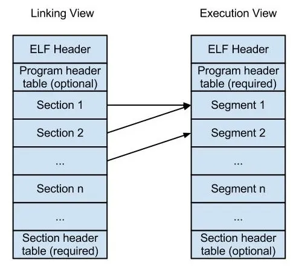

# What is ELF?
ELF, or Executable and Linkable Format, is a standard file format for executables, object code, shared libraries, and even core dumps on Unix-like operating systems. It serves as a bridge between the compiled source code and the operating system, facilitating the loading and execution of programs.

### Why ELF?
The ELF format is widely adopted due to its versatility and compatibility with various Unix-like operating systems, including Linux. It allows for the dynamic linking of libraries, making it possible to create modular and reusable code. ELF files also support position-independent code, enabling the use of address space layout randomization (ASLR) for enhanced security.

### What Information is Stored in ELF?
The ELF format stores essential information about an executable file, including:

* **Header Information**: Contains details about the ELF file such as its type, architecture, entry point, and program header table offset.
* **Section Headers**: Define various sections of the executable, including code, data, symbol tables, and more.
* **Program Headers**: Specify segments of the file, indicating which parts should be loaded into memory.
* **Symbol Tables**: Contain information about symbols in the code, aiding in debugging and linking.
* **Dynamic Section**: Holds information needed for dynamic linking, including shared library dependencies.

**Executable and Linkable Format (ELF)** is the generic file format for executables on any Unix-flavored OS (and some non-Unix ones).

* **Executable files:** `ls`, `grep`, `gcc`, etc.
* **Object code:** `main.o`, `print.o`, etc.
* **Shared libraries:** `libc.so.6`, `libm.so.6`, etc.
* **Core dumps:** A snapshot of a program's memory at the time of a crash

* **ELF HEADER :** It describes attributes of an ELF binary which include information useful to the loaders & linkers. It includes location to other body parts of an ELF binary which is helpful while implementing parsers for the binary.

* **PROGRAM HEADER TABLE :** A PHT describes the `segments` of an ELF binary. It is useful to the loader and the runtime linker (ld-Linux.so).

* **SECTION HEADER TABLE :** A SHT describes the `sections` of an ELF binary. It is useful to the compile-time linker (ld) and its presence is optional for program execution.

* **SECTIONS AND SEGMENTS :** It is the actual content of the binary. `sections` are just blocks of bytes present in linking view (on-disk view) to produce `segment` (which provide a runtime/in-memory view). `Segments` are blocks composed of one or more sections and are produced by linker.

ELF is the content stored for an executable and is responsible to direct the kernel on how to load the executable into memory for execution.

**Example**

Let's take a simple C program to understand the ELF format.

```c
#include <stdio.h>

int main() {
    printf("Hello, World!\n");
    return 0;
}
```

Now, let's compile this program and see the ELF structure.

```bash
# compile the C code
gcc -o test test.c
file test
```

Output:

```bash
test: ELF 64-bit LSB pie executable, ARM aarch64, version 1 (SYSV), dynamically linked, interpreter /lib/ld-linux-aarch64.so.1, BuildID[sha1]=cac59fe737ae3b16c4269a8d7614e50550f7addd, for GNU/Linux 3.7.0, not stripped
```

* The ELF format and the toolbox associated with it, which are the commands: `nm`, `objdump` and `readelf`.

* ELF is quite an incredible computer science at work, with program loading, dynamic linking, symbol tables lookup, and many other orchestrated components.
This post aims at giving more insight into the inner workings of program execution, and the tools we can use to dissect and read binary files.

## ELF Header

Contains general info about the binary, and act as a “roadmap” for navigate inside the binary.
Example:


```bash
# shows the ELF header
aarch64-linux-gnu-readelf -h test
ELF Header:
  Magic:   7f 45 4c 46 02 01 01 00 00 00 00 00 00 00 00 00 
  Class:                             ELF64
  Data:                              2's complement, little endian
  Version:                           1 (current)
  OS/ABI:                            UNIX - System V
  ABI Version:                       0
  Type:                              DYN (Position-Independent Executable file)
  Machine:                           AArch64
  Version:                           0x1
  Entry point address:               0x640
  Start of program headers:          64 (bytes into file)
  Start of section headers:          68520 (bytes into file)
  Flags:                             0x0
  Size of this header:               64 (bytes)
  Size of program headers:           56 (bytes)
  Number of program headers:         9
  Size of section headers:           64 (bytes)
  Number of section headers:         28
  Section header string table index: 27
```
ELF Header is always present at offset 0 of a binary file, its structure is of the form “Elfxx_Ehdr” (where xx is either 32 or 64 bits) and its defined in /usr/include/elf.h

```c
typedef struct elf64_hdr {
  unsigned char	e_ident[EI_NIDENT];	/* ELF "magic number" */
  Elf64_Half e_type;
  Elf64_Half e_machine;
  Elf64_Word e_version;
  Elf64_Addr e_entry;		/* Entry point virtual address */
  Elf64_Off e_phoff;		/* Program header table file offset */
  Elf64_Off e_shoff;		/* Section header table file offset */
  Elf64_Word e_flags;
  Elf64_Half e_ehsize;
  Elf64_Half e_phentsize;
  Elf64_Half e_phnum;
  Elf64_Half e_shentsize;
  Elf64_Half e_shnum;
  Elf64_Half e_shstrndx;
} Elf64_Ehdr;
```

### Magic bytes 7f 45 4c 46
* **Offset 0x00 to 0x03**: for EI_MAG0 to EI_MAG3, we have the four bytes 0x7f 45 4c 46, and if you check in ASCII, 45 4c 46 stands for ‘E’ ‘L’ ‘F’... ⭐️ Together, that four bytes acts as the ELF magic number, using ‘E’ ‘L’ ‘F’ is obvious, but the purpose of ‘0x7f’ is more a historical convention.
* **Offset 0x04**: EI_CLASS tells us whether the file is 32 or 64 bits, 0x01 for 32-bits and 0x02 for 64-bits.
* **Offset 0x05**: EI_DATA tells us which endianness is used, 0x01 for little and 0x02 for big-endian.

```
7f 45 4c 46 = ELF
```

### Other fields
* **Offset 0x06**: EI_VERSION tells us about the ELF version, 0x01 for current version.
* **Offset 0x07**: EI_OSABI tells us about the operating system ABI, 0x03 for Linux, 0x02 for UNIX, etc.
* **Offset 0x08**: EI_ABIVERSION tells us about the ABI version.
* **Offset 0x09 to 0x0f**: EI_PAD tells us about the padding.

Example fields:
* **Entry point address**: 0x640 (where the program should start executing)
* **Start of program headers**: 64 (bytes into file) (offset to the first program header)
* **Start of section headers**: 68520 (bytes into file) (offset to the first section header)
* **Flags**: 0x0
* **Size of this header**: 64 (bytes) (size of the ELF header)
* **Size of program headers**: 56 (bytes) (size of the program header)
* **Number of program headers**: 9 (number of program headers)
* **Size of section headers**: 64 (bytes) (size of the section header)
* **Number of section headers**: 28 (number of section headers)
* **Section header string table index**: 27 (index of the section header string table)


In our introduction, we stated that ELF is for Executable and Linkable Files, and that “and” is also found inside the ELF itself, yes indeed, the ELF format provides two “views”, an execution view “and” a linkable view. 
Let’s consider the following diagram:



* **Left-side** -> Our binary present on disk is divided into logical blocks, gathered as `sections`.

* **Right-side** -> Execution view represents a memory view of the binary, it exposes how the binary will be laid out into a process `address space`.
After getting loaded into memory, the binary is divided into logical blocks, the `segments`, and each `segment` maps to one or more `sections`.


## Section Headers Table

`Section headers table` gives us a summary about all the sections.

Among these sections names, let’s focus on the following ones: `.symtab & .dynsym` to introduce the concepts of symbols in binary files, because it will be related to the commands we will explain further: `nm` and `objdump`.

These are the tables storing the static and dynamic symbols for the binary. 
* `.symtab` is for static symbols
* `.dynsym` is for dynamic symbols

Wait a minute, what do you mean by a symbol ?
`Symbols` as the name suggests, are symbolic references to some `data` or `code`, such as `global variable` or `function`. A developper uses `names` to refer `functions` and `variables` throughout a `program`, these informations are known as the `program’s` symbolic information. But…the computer doesn’t care about `names`, our machine has a an `address & offset diet`. That’s why these symbolic references gets translated in machine code into offsets and addresses.

Example:
```bash
aarch64-linux-gnu-readelf -S --wide test
There are 28 section headers, starting at offset 0x10ba8:

Section Headers:
  [Nr] Name              Type            Address          Off    Size   ES Flg Lk Inf Al
  ...
  [ 5] .dynsym           DYNSYM          00000000000002b8 0002b8 0000f0 18   A  6   3  8
  [ 6] .dynstr           STRTAB          00000000000003a8 0003a8 000092 00   A  0   0  1 << String table for .dynsym
  ...
  [25] .symtab           SYMTAB          0000000000000000 010040 000840 18     26  65  8
  [26] .strtab           STRTAB          0000000000000000 010880 00022c 00      0   0  1 << String table for .symtab
  ...
  
Key to Flags:
  W (write), A (alloc), X (execute), M (merge), S (strings), I (info),
  L (link order), O (extra OS processing required), G (group), T (TLS),
  C (compressed), x (unknown), o (OS specific), E (exclude),
  D (mbind), p (processor specific)
```
`dynsym` flag `A` for alloc means it will be allocates at runtime and loaded in memory but `symtab` flag is not `A` allocated and hence not loaded in memory.

**A single ELF file may contain a maximum of two symbol tables: `.symtab` and `.dynsym`**

### `.symtab`
We refer `.symtab` as the binary global’s symbol table, containing all the symbol references in the current ELF file.
Along with `.symtab`, you’ll find `.strtab`, the string table of `.symtab`, which stores null-terminated strings used to reference objects from different sections.

### `.dynsym`
We refer `.dynsym` which holds symbols needed for dynamic linking. When we develop a program, sometimes we want to use symbols that don’t reside within the context of our program, but are instead defined in external object such as libraries. Like `.symtab`/.`.strtab` relationship, `.dynsym` got its own string table, referred `.dynstr`

That ALLOC means that `.dynsym` will be allocated at runtime and loaded in memory, but `.symtab` is not loaded into memory because it is useless for runtime.

**stripped**
NOTE: `.dynsym` contains what is necessary for execution, whereas `.symtab` exists only for debugging and linking purposes — and is often “stripped” (removed) from the binaries to save space.

## Program Headers

```bash
# shows the program headers
aarch64-linux-gnu-readelf -l test

Elf file type is DYN (Position-Independent Executable file)
Entry point 0x640
There are 9 program headers, starting at offset 64

Program Headers:
  Type           Offset             VirtAddr           PhysAddr
                 FileSiz            MemSiz              Flags  Align
  PHDR           0x0000000000000040 0x0000000000000040 0x0000000000000040
                 0x00000000000001f8 0x00000000000001f8  R      0x8
  INTERP         0x0000000000000238 0x0000000000000238 0x0000000000000238
                 0x000000000000001b 0x000000000000001b  R      0x1
      [Requesting program interpreter: /lib/ld-linux-aarch64.so.1]
  LOAD           0x0000000000000000 0x0000000000000000 0x0000000000000000
                 0x000000000000089c 0x000000000000089c  R E    0x10000
  LOAD           0x000000000000fd90 0x000000000001fd90 0x000000000001fd90
                 0x0000000000000280 0x0000000000000288  RW     0x10000
  DYNAMIC        0x000000000000fda0 0x000000000001fda0 0x000000000001fda0
                 0x00000000000001f0 0x00000000000001f0  RW     0x8
  NOTE           0x0000000000000254 0x0000000000000254 0x0000000000000254
                 0x0000000000000044 0x0000000000000044  R      0x4
  GNU_EH_FRAME   0x00000000000007a8 0x00000000000007a8 0x00000000000007a8
                 0x000000000000003c 0x000000000000003c  R      0x4
  GNU_STACK      0x0000000000000000 0x0000000000000000 0x0000000000000000
                 0x0000000000000000 0x0000000000000000  RW     0x10
  GNU_RELRO      0x000000000000fd90 0x000000000001fd90 0x000000000001fd90
                 0x0000000000000270 0x0000000000000270  R      0x1

 Section to Segment mapping:
  Segment Sections...
   00     
   01     .interp 
   02     .interp .note.gnu.build-id .note.ABI-tag .gnu.hash .dynsym .dynstr .gnu.version .gnu.version_r .rela.dyn .rela.plt .init .plt .text .fini .rodata .eh_frame_hdr .eh_frame 
   03     .init_array .fini_array .dynamic .got .data .bss 
   04     .dynamic 
   05     .note.gnu.build-id .note.ABI-tag 
   06     .eh_frame_hdr 
   07     
   08     .init_array .fini_array .dynamic .got 
```

```bash
# shows the section headers
readelf -S hello

aarch64-linux-gnu-readelf -S test
There are 28 section headers, starting at offset 0x10ba8:

Section Headers:
  [Nr] Name              Type             Address           Offset
       Size              EntSize          Flags  Link  Info  Align
  [ 0]                   NULL             0000000000000000  00000000
       0000000000000000  0000000000000000           0     0     0
  [ 1] .interp           PROGBITS         0000000000000238  00000238
       000000000000001b  0000000000000000   A       0     0     1
  [ 2] .note.gnu.bu[...] NOTE             0000000000000254  00000254
       0000000000000024  0000000000000000   A       0     0     4
  [ 3] .note.ABI-tag     NOTE             0000000000000278  00000278
       0000000000000020  0000000000000000   A       0     0     4
  [ 4] .gnu.hash         GNU_HASH         0000000000000298  00000298
       000000000000001c  0000000000000000   A       5     0     8
  [ 5] .dynsym           DYNSYM           00000000000002b8  000002b8
       00000000000000f0  0000000000000018   A       6     3     8
  [ 6] .dynstr           STRTAB           00000000000003a8  000003a8
       0000000000000092  0000000000000000   A       0     0     1
  [ 7] .gnu.version      VERSYM           000000000000043a  0000043a
       0000000000000014  0000000000000002   A       5     0     2
  [ 8] .gnu.version_r    VERNEED          0000000000000450  00000450
       0000000000000030  0000000000000000   A       6     1     8
  [ 9] .rela.dyn         RELA             0000000000000480  00000480
       00000000000000c0  0000000000000018   A       5     0     8
  [10] .rela.plt         RELA             0000000000000540  00000540
       0000000000000078  0000000000000018  AI       5    21     8
  [11] .init             PROGBITS         00000000000005b8  000005b8
       0000000000000018  0000000000000000  AX       0     0     4
  [12] .plt              PROGBITS         00000000000005d0  000005d0
       0000000000000070  0000000000000000  AX       0     0     16
  [13] .text             PROGBITS         0000000000000640  00000640
       0000000000000138  0000000000000000  AX       0     0     64
  [14] .fini             PROGBITS         0000000000000778  00000778
       0000000000000014  0000000000000000  AX       0     0     4
  [15] .rodata           PROGBITS         0000000000000790  00000790
       0000000000000016  0000000000000000   A       0     0     8
  [16] .eh_frame_hdr     PROGBITS         00000000000007a8  000007a8
       000000000000003c  0000000000000000   A       0     0     4
  [17] .eh_frame         PROGBITS         00000000000007e8  000007e8
       00000000000000b4  0000000000000000   A       0     0     8
  [18] .init_array       INIT_ARRAY       000000000001fd90  0000fd90
       0000000000000008  0000000000000008  WA       0     0     8
  [19] .fini_array       FINI_ARRAY       000000000001fd98  0000fd98
       0000000000000008  0000000000000008  WA       0     0     8
  [20] .dynamic          DYNAMIC          000000000001fda0  0000fda0
       00000000000001f0  0000000000000010  WA       6     0     8
  [21] .got              PROGBITS         000000000001ff90  0000ff90
       0000000000000070  0000000000000008  WA       0     0     8
  [22] .data             PROGBITS         0000000000020000  00010000
       0000000000000010  0000000000000000  WA       0     0     8
  [23] .bss              NOBITS           0000000000020010  00010010
       0000000000000008  0000000000000000  WA       0     0     1
  [24] .comment          PROGBITS         0000000000000000  00010010
       000000000000002d  0000000000000001  MS       0     0     1
  [25] .symtab           SYMTAB           0000000000000000  00010040
       0000000000000840  0000000000000018          26    65     8
  [26] .strtab           STRTAB           0000000000000000  00010880
       000000000000022c  0000000000000000           0     0     1
  [27] .shstrtab         STRTAB           0000000000000000  00010aac
       00000000000000fa  0000000000000000           0     0     1
Key to Flags:
  W (write), A (alloc), X (execute), M (merge), S (strings), I (info),
  L (link order), O (extra OS processing required), G (group), T (TLS),
  C (compressed), x (unknown), o (OS specific), E (exclude),
  D (mbind), p (processor specific)

```

# ELF Header
