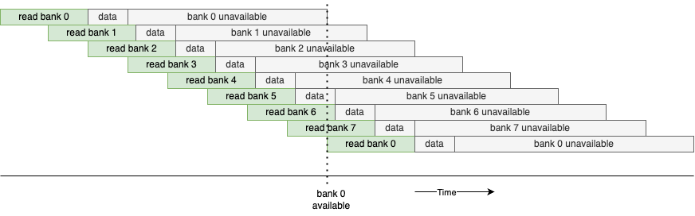
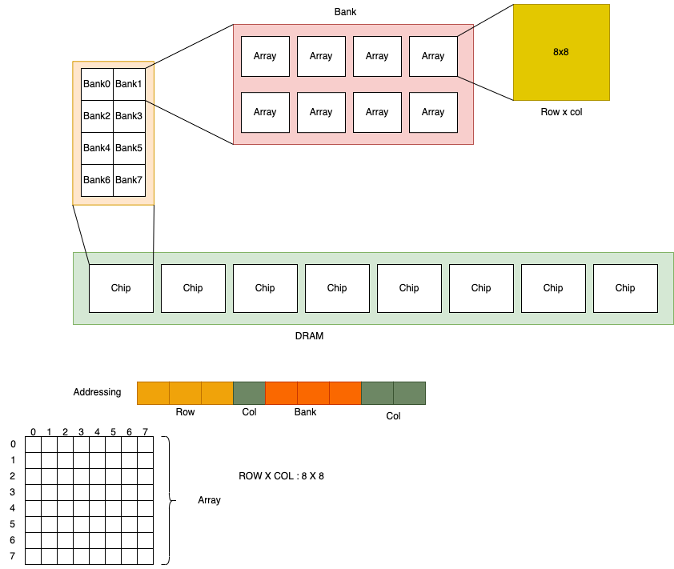
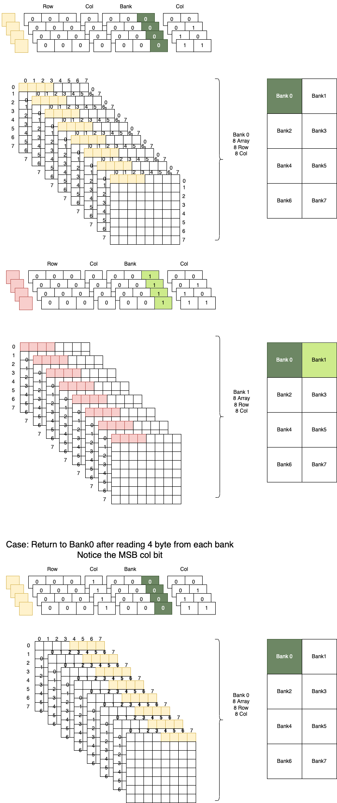

= DRAM - Dynamic Random Access Memory  

== About DRAM
Dynamic Random Access Memory (DRAM) is a type of volatile semiconductor memory
that stores each bit of data in a separate capacitor within an integrated
circuit. Unlike static RAM (SRAM), which uses bistable latching circuitry, DRAM
relies on capacitors that need periodic refreshing due to their natural leakage,
making it a "dynamic" form of memory.

== Why DRAM requires periodic refresh
DRAM (Dynamic Random Access Memory) requires refreshing due to the way it stores
data in its memory cells. Each DRAM cell is made up of a capacitor and a
transistor, and the capacitor is used to store a bit of data as an electrical
charge. However, capacitors are not perfect and gradually lose their charge over
time. This gradual loss of charge is why DRAM needs periodic refreshing.

NOTE: SRAM (Static Random Access Memory) does not require refreshing like DRAM
because of its fundamentally different architecture for storing data. Unlike DRAM,
which uses capacitors that need to be periodically recharged to retain data, SRAM
uses a bistable circuit composed of transistors to maintain a stable state
without the need for periodic refresh cycles.

== DRAM bank interleaving
DRAM bank interleaving is a technique used in computer memory management to
improve the performance of DRAM (Dynamic Random Access Memory). It involves
distributing consecutive memory addresses across multiple DRAM banks rather than
keeping them sequentially within a single bank. This allows multiple memory
banks to be accessed in parallel, reducing wait times and increasing overall
data throughput.

* A DRAM read request is initiated, but the bank requires some delay before it
can output data. After sending the data, the bank also needs a recovery period
before it can serve another request.
* Data bursts can be launched for successive read requests, allowing read data
to come from different DRAM banks.

== Understanding the DRAM Configuration: `2Gb x 8`
* `2Gb` (Gigabits): This is the total storage capacity of the DRAM chip, which is
2 gigabits or 2,147,483,648 bits.
* `x8` (Width): This indicates that each data word is 8 bits (1 byte) wide. In
other words, the chip has a data width of 8 bits.

=== Calculating Key Parameters
* Total Bits in the Chip: The total storage is 2Gb = 2^31 bits.
* Data Width (x8): Each word is 8 bits wide, meaning the chip has 8 output data
pins.
* Number of Words (Rows x Columns): To find the number of addressable words in
the chip:

----
Total Number of Words = Total Bits / Data Width 
                      = 2^31 / 8 
                      = 2^28 words
So, there are 2^28 words in total.
----
=== Translating to DRAM Components (Bank, Row, Column)
Now, let's break down how this total capacity is organized in terms of banks,
rows, and columns.

* Banks: Modern DRAM chips are typically organized into multiple banks. Let's
assume the chip has 8 banks (a common configuration for DRAM).
The number of banks is represented by a number of bits. 
* For 8 banks, we need 3 bits to uniquely identify each bank:

----
Number of Banks = 2^3 = 8
----

* Rows and Columns: The total number of addressable words (2^28 words) must be
divided among the banks.

----
Words per Bank = Total Words
Number of Banks = 2^28/2^3 = 2^25 words per bank
----

* Row and Column Addressing: Each bank is typically organized in a 2-dimensional
array of rows and columns:

----
Number of Rows x Number of Columns.
Words per Bank = Number of Rows x Number of Columns.
Let's assume a common DRAM configuration with 16K rows (2^14 rows):

Number of Columns per Row = 2^25/2^14 = 2^11 columns
----

* So, there are 16K rows and 2K columns per row in each bank.

* Address Bit Allocation Given the configuration above, we need to map the
28-bit address space to the row, column, and bank addresses:
* Row Address: We have 2^14 rows in each bank, so 14 bits are needed to
represent the row address.
* Column Address: We have 2^11 columns per row, so 11 bits are needed to
represent the column address.
* Bank Address: There are 8 banks, requiring 3 bits to represent the bank
address.

----
For a 2Gb x 8 DRAM chip:

The chip is organized into 8 banks, each containing 16K rows and 2K columns.
Address bits are allocated as 3 for banks, 14 for rows, and 11 for columns.
The memory controller translates a physical address into these bank, row, and
column addresses to read or write data.
----

== Memory addressing
* The 14 most significant bits (MSBs) represent the row address.
* The next 3 bits identify the bank.
* The 11 least significant bits (LSBs) represent the column address.

NOTE: The exact bit mapping can vary by controller and configuration, but for
this 2Gb x 8 example, we use the full 28-bit address space derived above.

== Advanced Memory Addressing Concepts

While the previous example focused on a single chip, real-world systems use a
hierarchical structure.

=== DRAM Hierarchy
The physical address is mapped to a specific location within this hierarchy:

* **Channel**: The highest level of the hierarchy. Independent path to memory.
* **DIMM (Dual In-line Memory Module)**: The physical module plugged into the
  motherboard.
* **Rank**: A set of DRAM chips on a DIMM that are accessed simultaneously to
  fill the data bus width (e.g., 64 bits).
* **Bank Group**: (DDR4/DDR5) Groups of banks that allow for faster back-to-back
  accesses.
* **Bank**: Independent arrays within a chip that can be active simultaneously.
* **Row**: A line of data within a bank (opened/activated into the row buffer).
* **Column**: The specific data word within the open row.

=== Role of the Memory Controller
The Memory Controller is the intelligent agent responsible for:
1.  **Address Translation**: Converting the system's physical address into the
    specific Channel, Rank, Bank, Row, and Column addresses.
2.  **Command Scheduling**: Issuing commands (ACTIVATE, READ, WRITE, PRECHARGE)
    while respecting timing constraints (tRAS, tRCD, tCL, etc.).
3.  **Refresh Management**: Ensuring data is preserved by issuing periodic
    REFRESH commands.

== Performance Implications

Efficient address mapping is crucial for system performance.

=== Bank Interleaving
As mentioned earlier, accessing a DRAM cell takes time.
*   **The Problem**: If we sequentially access data in the *same* bank, we must
    wait for the bank to close (Precharge) and open a new row (Activate) if the
    row changes.
*   **The Solution**: By mapping consecutive addresses to *different* banks, the
    memory controller can initiate a read in Bank A, and while Bank A is busy,
    initiate a read in Bank B. This "hides" the latency and saturates the data
    bus.

=== Bank Thrashing
*   **Definition**: Repeatedly accessing different rows within the *same* bank.
*   **Impact**: High latency. The controller must constantly Close Row A -> Open
    Row B -> Read -> Close Row B -> Open Row A. This is the worst-case scenario
    for DRAM performance.
*   **Mitigation**: Address mapping schemes are designed to spread frequently
    accessed data across different banks to minimize this occurrence.

=== Burst Access
To improve efficiency, DRAM doesn't just read a single word.
*   **Burst Mode**: A single READ command triggers a "burst" of data (e.g., 8
    consecutive words).
*   **Benefit**: This amortizes the cost of the command overhead over multiple
    data transfers, maximizing bus utilization.

== Example of how addressing actually works

* According to the addressing scheme, 4 columns are read in a sequence (00, 01,
10, 11).
* There are 8 arrays within the bank that share the same row and column
addresses, resulting in a burst of 4 bytes (4 bytes read from each array).
* The DIMM is set up to perform this burst automatically.
* The column address increments from 0 to 3.

== Real-World Example: Micron DDR4 8Gb x8 Chip

To make these concepts concrete, let's look at the specifications of a real
DRAM chip: the **Micron MT40A1G8** (8Gb DDR4 SDRAM).

=== Specifications
*   **Density**: 8Gb (Gigabits)
*   **Configuration**: 1 Gig x 8
*   **Bank Architecture**: 16 Banks (4 Bank Groups x 4 Banks per Group)
*   **Row Address**: 64K (A[15:0] -> 16 bits)
*   **Column Address**: 1K (A[9:0] -> 10 bits)
*   **Page Size**: 1KB

=== Verifying the Capacity
Let's calculate the total capacity based on the address bits to verify it matches
8Gb.

1.  **Number of Banks**: 16 Banks
2.  **Number of Rows**: $2^{16} = 65,536$ rows per bank
3.  **Number of Columns**: $2^{10} = 1,024$ columns per row
4.  **Data Width**: 8 bits

**Total Capacity Calculation**:
----
Capacity = Banks x Rows x Columns x Width
         = 16 x 65,536 x 1,024 x 8 bits
         = 16 x 67,108,864 x 8 bits
         = 8,589,934,592 bits
         = 8 Gigabits (8Gb)
----

=== Understanding "Page Size"
In DRAM terminology, a "Page" refers to the amount of data held in a single row.
When a row is activated, the entire page is loaded into the Sense Amplifiers
(Row Buffer).

*   **Page Size Calculation**:
    *   Columns per Row: 1,024 (1K)
    *   Data Width: 8 bits (1 Byte)
    *   Page Size = $1K \times 1 Byte = 1KB$

So, every time you activate a row in this chip, you are effectively opening a
1KB "page" of memory.

=== Addressing in Action
To read a specific byte from this chip, the memory controller provides:
1.  **Bank Group (2 bits)** & **Bank Address (2 bits)**: To select one of the 16
    banks.
2.  **Row Address (16 bits)**: To Activate a specific row (e.g., Row #12,345).
    *   *Action*: The 1KB page from Row #12,345 is loaded into the sense amps.
3.  **Column Address (10 bits)**: To Read a specific byte from that open page.
    *   *Action*: The data at Column #500 is sent out on the data bus.

== References
* https://youtu.be/-xtWsQvOcjo?si=UQXL7RkYAJIMfH6_